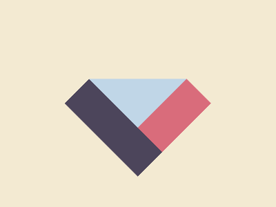

# ✅ CSS Battle Daily Target: 18/05/2025

  
[Play Challenge](https://cssbattle.dev/play/qyEAiuTbG8ej4o7OFmUF)  
[Watch Solution Video](https://youtube.com/shorts/5NB10sRn4XA)

---

## 🔢 Stats

**Match**: ✅ 100%  
**Score**: 🟢 662.36 (Characters: 195)

---

## ✅ Code

```html
<p><a>
<style>
*{
  background:#F3EAD2;
  *{
    background:#C0D6E7;
    margin:115 130
  }
}
  p,a{
    position:fixed;
    background:#D96C7B;
    padding:75+25;
    rotate:45deg;
    margin:-5 80
  }
  a{
    background:#4C455B;
    rotate:90deg;
    margin:-25-75
  }
</style>
```

---

## ✅ Code Explanation

The markup uses only `<p><a>`, giving us **two usable elements** with just one tag — a classic CSS Battle trick to save characters.

---

### 🎨 Background Setup

The outer `*` selector sets the **canvas background** to a light beige (`#F3EAD2`). Then, nested inside, another universal selector applies a **light blue background** (`#C0D6E7`) and a `margin: 115 130` to both `<p>` and `<a>`. This centers and places the blue square background block on the canvas.

So, we get one **large light-blue square** (rotated later) sitting on a beige canvas.

---

### 🔺 Shared Styles for `<p>` and `<a>`

Both elements are:

* `position: fixed` to remove them from document flow and allow absolute placement.
* Given a `background` of reddish-pink (`#D96C7B`).
* Assigned `padding: 75+25` which is shorthand for `padding: 100`, creating a large square.
* Rotated by `45deg`, turning the square into a **diamond shape**.
* Positioned with `margin: -5 80`, nudging the first pink diamond into place over the blue base.

---

### 🟪 Styles for `<a>` (the Second Element)

The `<a>` element overrides some properties:

* Its `background` becomes dark purple (`#4C455B`).
* It's rotated to `90deg`, making the square stand on its side.
* The margin changes to `-25 -75`, shifting this element left and slightly up.

This places the dark purple rotated square **beneath the first pink diamond**, completing the overlapping diamond design.

---

### 🧠 Techniques Used

* **Nested universal selectors** to apply layered styles efficiently.
* **Use of rotation** (`rotate`) to create diamond shapes from square elements.
* **Padding** to define square sizes without using width/height.
* **Fixed positioning** to precisely place overlapping elements.
* **Minimal tags** with maximum reuse for visual efficiency.

---

### 🧩 Final Visual

* A **light blue rotated square** sits centered.
* On top of it, a **pink diamond** rotated at 45 degrees.
* Beneath that, a **dark purple square** rotated 90 degrees, peeking from behind.

Everything fits together tightly, forming a layered and symmetric abstract shape — achieved with only two elements and clever styling.