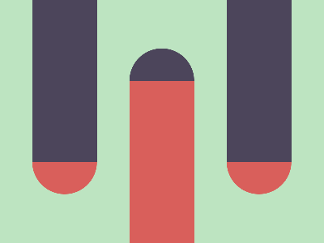

# ✅ CSS Battle Daily Target: 19/05/2025

  
[Play Challenge](https://cssbattle.dev/play/LJB84A1PFsKAXJbOoO4q)  
[Watch Solution Video](https://youtube.com/shorts/2vH0TC1o7Z0)

---

## 🔢 Stats

**Match**: ✅ 99.9%  
**Score**: 🟢 597.69 (Characters: 256)

---

## ✅ Code

```html
<p><a>
<style>
*{
  background:#BDE4C1;
  *{
    background:linear-gradient(#4C455B 16.5%,#D95F5B 0);
    border-radius:60q 60q 0 0;
    margin:60 160 0
  }
}
  p,a{
    position:fixed;
    padding:150+40;
    background:linear-gradient(#D95F5B 13.5%,#4C455B 0);
    margin:-120
  }
  p{
    scale:-1
  }
  a{
    margin:-150-280
  }
</style>
```

---

## ✅ Code Explanation

Only `<p><a>` are used — again, a minimalistic approach with **two stylable elements** to keep the character count low.

---

### 🎨 Background Setup

The first universal selector (`*`) sets the **canvas background color** to a **light mint green** (`#BDE4C1`).

Inside that, a **nested universal selector** applies:

* A **top-half dark-to-red gradient** (`linear-gradient(#4C455B 16.5%, #D95F5B 0)`)
* A **rounded top border** via `border-radius: 60q 60q 0 0`
* A **margin of 60 160 0**, pushing this block down slightly and centering it horizontally

This creates the **top capsule shape**, which acts as the **main half-circle background element** at the top.

---

### 🔺 Shared Styles for `<p>` and `<a>`

Both elements:

* Use `position: fixed` for absolute positioning
* Are styled with a **reverse gradient** from **red to dark purple** (`#D95F5B 13.5%, #4C455B 0`)
* Have large `padding: 150+40` (shorthand for 190), giving them a **tall vertical capsule shape**
* Use `margin: -120`, shifting them upward into visible space

This places two tall vertical capsules in the middle of the canvas, stacked or mirrored.

---

### 🔄 Flip and Reposition

* The `<p>` element is **flipped vertically** using `scale: -1`, so its gradient now appears inverted — making it look like a **bottom capsule**.
* The `<a>` element is **pushed left and up** with `margin: -150 -280`, separating it from `<p>` and forming a horizontally balanced structure.

---

### 🧠 Techniques Used

* **Nested universal selectors** to layer backgrounds with gradients and radius
* **Mirroring** with `scale: -1` to reuse shapes efficiently
* **Fixed positioning and margin tricks** to place shapes precisely
* **Gradient flipping** to simulate opposing capsule ends
* **Reversed color gradients** to create visual contrast

---

### 🧩 Final Visual Composition

* A **top capsule** is created using the nested `*` selector, centered at the top.
* The `<p>` and `<a>` elements form **vertical capsules** — one mirrored — giving the feel of **pill-shaped tubes** aligned vertically.
* Together, the composition looks like a **test-tube style lab setup** with pleasing symmetry.