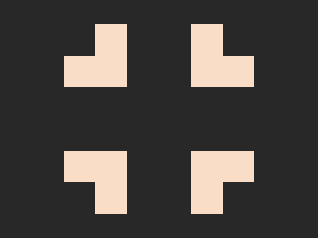

# ✅ CSS Battle Daily Target: 20/05/2025

  
[Play Challenge](https://cssbattle.dev/play/J5omtqoNWuS9G47zqiWE)  
[Watch Solution Video](https://youtube.com/shorts/zPRRvaTFprE)

---

## 🔢 Stats

**Match**: ✅ 100%  
**Score**: 🟢 685.41 (Characters: 162)

---

## ✅ Code

```html
<p><a>
<style>
*{
  background:#282828
}
  p,a{
    position:fixed;
    padding:20;
    margin:22 72;
    box-shadow:21q 21q 0 21q#F9DDC6;
    -webkit-box-reflect:right 160px
  }
  a{
    scale:-1;
    margin:180
  }
</style>
```

---

## ✅ Code Explanation

Used just two HTML elements — `<p>` and `<a>` — a minimal and effective approach to get the job done with a low character count.

---

### 🎨 Background

The canvas background is set to a dark gray color `#282828`, which becomes the foundation on which the design elements stand out.

---

### 🟧 Main Shape Creation

Both `<p>` and `<a>` are absolutely positioned (`position: fixed`), given a uniform `padding` of `20`, and a `margin` of `22 72` to position them on the screen.

Each element uses a `box-shadow` offset of `21q 21q`, with no blur and a spread of `21q`, colored `#F9DDC6`. This simulates a large rounded quarter shape — like a soft blob in one corner of the box.

Then comes the clever trick: `-webkit-box-reflect: right 160px` — this mirrors the shape horizontally to the right, producing a second identical blob automatically.

---

### 🔄 Flipping the Second Element

The `<a>` element is flipped horizontally using `scale: -1`, which mirrors its visual content. It's also repositioned with `margin: 180` to move it to the bottom part of the canvas.

Combined with the reflection, this creates two more blobs — one directly and one as a mirror — effectively filling all four corners of a square grid.

---

### 🧠 Key Techniques Used

* Minimal HTML: Only two tags.
* Box-shadow with large spread radius to simulate circular shapes.
* WebKit reflection to mirror elements without extra DOM.
* CSS `scale` to flip elements and reduce duplication.
* Fixed positioning for precise layout.
