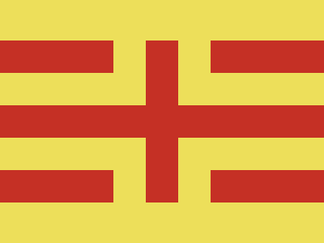

# ✅ CSS Battle Daily Target: 21/05/2025

  
[Play Challenge](https://cssbattle.dev/play/DBzBme8qh4CaDBy9PrBC)  
[Watch Solution Video](https://youtube.com/shorts/hQNu1lfed3A)

---

## 🔢 Stats

**Match**: ✅ 100%  
**Score**: 🟢 663.56 (Characters: 193)

---

## ✅ Code

```html
<p><a>
<style>
  *{
    background:#EDDF5A;
    *{
    background:#C53025;
    margin:50 0
  }
  }
  p,a{
    position:fixed;
    padding:20+70;
    border:43q solid#EDDF5A;
    margin:-40;
    -webkit-box-reflect:right 40px
  }
  a{
    scale:-1;
    margin:106q 159q
  }
</style>
```

---

## ✅ Code Explanation

Used just `<p>` and `<a>` again — a common strategy in CSS Battle for achieving minimal markup and character count efficiency.

---

### 🎨 Background

The outer `*` selector sets the canvas background to a **yellow shade** `#EDDF5A`.

Inside it, a **nested universal selector** (`*{}` within `*{}`) applies a **red background** (`#C53025`) and vertical spacing (`margin: 50 0`) to all elements — creating the red bars.

This creates **two horizontal red stripes**, one at the top and one at the bottom, due to the margins pushing them vertically apart.

---

### 🟥 Central Circles

The two tags `<p>` and `<a>` are both absolutely positioned (`position: fixed`) and styled as perfect circles using:

* A combined `padding: 20+70` (evaluates to `90`)
* A `border` of `43q solid #EDDF5A` (yellow), which visually carves out a **ring** against the red background

The key trick is using `-webkit-box-reflect: right 40px` to mirror each circle horizontally, so you get **two circles per element** — one drawn and one reflected.

---

### 🔄 Flipping for Symmetry

The `<a>` element is flipped horizontally with `scale: -1` and repositioned using `margin: 106q 159q`. This moves it to the bottom-right quadrant.

Together, the `<p>` and `<a>` elements — with their mirrored reflections — create **four ring shapes** that align in a square pattern.

---

### 🧠 Techniques Used

* **Nested universal selectors** to reduce characters while applying background and margin
* **Box reflections** to create symmetry and reduce DOM
* **Negative margins and fixed positioning** to position elements precisely
* **Border tricks** to create ring shapes
* **Element flipping with scale** to avoid additional markup
