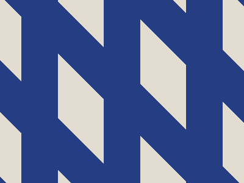

# ✅ CSS Battle Daily Target: 22/05/2025

  
[Play Challenge](https://cssbattle.dev/play/Pq6ITCn92oMLOk33StZp)  
[Watch Solution Video](https://youtube.com/shorts/iDtc9Kb8K80)

---

## 🔢 Stats

**Match**: ✅ 100%  
**Score**: 🟢 673.33 (Characters: 178)

---

## ✅ Code

```html
<p>
<style>
*{
  background:#E3DCD1;
  *{
    background:#243D83;
    margin:0 170;
    color:243D83;
    box-shadow:143q 0,-143q 0,286q 0,-286q 0
  }
}
  p{
    position:fixed;
    padding:245+30;
    rotate:-45deg;
    margin:-95-0
  }
</style>
```

---

## ✅ Code Explanation

This solution cleverly uses a single `<p>` tag and smart CSS tricks to recreate a clean and symmetrical shape arrangement using minimal code — just **178 characters**!

---

### 🎨 Background

The outer `*` selector sets the canvas background to a **light beige** (`#E3DCD1`), forming the overall backdrop.

Then, a **nested universal selector** (`*{}` inside the main `*{}`) sets the default element background to **dark blue** (`#243D83`) and applies:

* A horizontal margin of `170`
* A custom `box-shadow` using four values: `143q 0`, `-143q 0`, `286q 0`, and `-286q 0`

This creates **five identical vertical bars** of the same color: one central bar and two mirrored pairs on the left and right — perfectly spaced.

---

### 🟥 Central Shape

The `<p>` element is positioned using:

* `position: fixed` for precise placement
* `padding: 245+30` which evaluates to `275`, creating a large square
* `rotate: -45deg` which turns the square into a **diamond**
* `margin: -95 -0` to nudge the shape into position

The large blue diamond sits in the center, overlapping the vertical bars and forming the focal point of the design.

---

### 🧠 Techniques Used

* **Nested universal selectors** to keep the code short and reusable
* **Box-shadow replication** for symmetrical bar duplication without extra HTML
* **Math expressions (`245+30`)** to reduce characters and achieve required sizing
* **Rotation and margin adjustments** for diamond placement
* **Minimal markup** — just one HTML tag