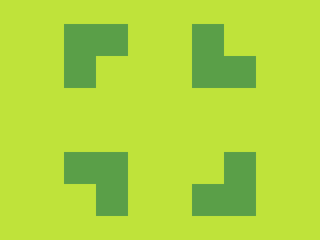

# ✅ CSS Battle Daily Target: 23/05/2025

  
[Play Challenge](https://cssbattle.dev/play/qm1K1YMTq2lxmoVHc6C1)  
[Watch Solution Video](https://youtube.com/shorts/UdLTJ7r3EOE)

---

## 🔢 Stats

**Match**: ✅ 100%  
**Score**: 🟢 675.45 (Characters: 175)

---

## ✅ Code

```html
<p><a>
<style>
*{
  background:#BFE33A
}
  p,a{
    position:fixed;
    padding:20;
    margin:62 112;
    box-shadow:-21q -21q 0 21q#5A9F48,160px -40px#BFE33A,148q -21q 0 21q#5A9F48
  }
  a{
    scale:-1;
    margin:100
  }
</style>
```

---

## ✅ Code Explanation

This solution creates four overlapping leaf-like shapes arranged symmetrically in a rotated X pattern, using just two HTML elements: a `<p>` and an `<a>` tag. The magic happens through precise use of `box-shadow`, mirroring, and minimal styling.

---

### 🎨 Background

The universal selector sets the background color to lime green (`#BFE33A`). This acts as the canvas and the visible space between the leaf shapes.

---

### 🍃 Leaf Shapes with Box-Shadow

Both the `<p>` and `<a>` elements are given fixed positioning, equal padding, and a top-centered margin to place them near the upper half of the canvas. Each of these elements uses a `box-shadow` with three parts:

1. A dark green ellipse positioned to the top-left.
2. A lime green shadow (same as the background) strategically placed to **mask** part of the first ellipse.
3. Another dark green ellipse positioned to the top-right.

Together, these create a symmetrical pair of leaf-like shapes on either side of the element.

---

### 🔁 Mirroring the Bottom Half

The `<a>` element mirrors the `<p>` element by applying a vertical flip using `scale: -1`. This reflects the top shapes to the bottom. A different margin is applied to offset the vertical position, aligning the bottom shapes with the top ones.

---

### 🧠 Techniques Used

* Used just two elements to create a mirrored layout.
* Employed `box-shadow` to simulate multiple shapes from a single element.
* Masked part of the shadow using the same background color to achieve overlapping effects.
* Used `scale: -1` for symmetry without duplicating shape logic.
* Fine-tuned spacing with `margin` to position everything precisely.