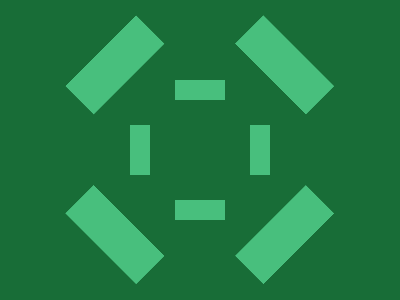

# ✅ CSS Battle Daily Target: 26/05/2025

  
[Play Challenge](https://cssbattle.dev/play/2ZHacHNgLjfK91OZFvXX)  
[Watch Solution Video](https://youtube.com/shorts/60xfHgaeQzc)

---

## 🔢 Stats

**Match**: ✅ 100%  
**Score**: 🟢 658.89 (Characters: 201)

---

## ✅ Code

```html
<p><a><b><c>
<style>
*{
  background:#186D37
}
  p,a,b,c{
    position:fixed;
    padding:10+25;
    background:#48BF7D;
    margin:72+167;
    box-shadow:0 127q#48BF7D
  }
  a,c{
    rotate:90deg;
    margin:50+35
  }
  b{
    scale:2;
    margin:-35 60;
    rotate:45deg
  }
</style>
```

---

## ✅ Code Explanation

This challenge displays a plus-like layout made of four **rounded green bars** arranged on a **dark green background**. These bars are laid out vertically and horizontally, mirrored both ways, forming a cross pattern.

---

### 🟩 Background

The universal selector (`*`) sets the background color to a deep green (`#186D37`), giving the entire canvas a solid base color.

---

### 🧱 Base Shape Setup

The tags `<p>`, `<a>`, `<b>`, and `<c>` are all positioned using `position: fixed`, which lets you place them freely without relying on the normal document flow. Each element:

* Gets a light green background (`#48BF7D`)
* Has padding applied with a horizontal bias (taller than wide), which results in a rounded pill shape
* Uses a margin to position it around the center
* Uses a `box-shadow` to duplicate the exact same shape lower on the canvas, effectively rendering two bars from a single element

---

### 🔄 Rotation for Horizontal Bars

The `<a>` and `<c>` elements are rotated by 90 degrees. This transforms the vertical pill shape into a horizontal bar. Their margins are adjusted to place them correctly on the canvas, aligning them in the left and right positions of the cross layout.

---

### ✖️ Scaling and Diagonal Positioning

The `<b>` element is scaled to twice its normal size using `scale: 2`, making it visually dominant. It’s rotated by 45 degrees, giving it a diagonal twist that adds complexity to the layout. Its margin is also customized to position it just right to not overlap or break the balance of the design.

---

### 🧠 Techniques Used

* Minimal HTML elements (just four tags) create eight visible bars using `box-shadow`
* Rotations (`rotate: 90deg` and `rotate: 45deg`) let the same shape serve different visual roles
* `scale` increases the size without needing extra markup
* Inline math expressions (like `padding: 10+25`) reduce character count
* Custom tags like `<c>` are valid in HTML and help squeeze in functionality within the strict character limit