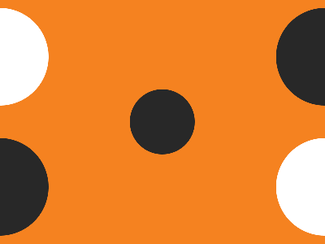

# ✅ CSS Battle Daily Target: 29/05/2025

  
[Play Challenge](https://cssbattle.dev/play/8XWCV8kX9OqJVQsjbuQh)  
[Watch Solution Video](https://youtube.com/shorts/tp7znZLzM18)

---

## 🔢 Stats

**Match**: ✅ 100%  
**Score**: 🟢 671.94 (Characters: 180)

---

## ✅ Code

```html
<p><a>
<style>
*{
  background:#F58220;
  *{
    background:#282828;
    border-radius:50%;
    margin:110 160
  }
}
  p,a{
    position:fixed;
    padding:60;
    margin:60-220;
    box-shadow:0-169q#FFF
  }
  a{
    scale:-1;
    margin:-220 340
  }
</style>
```

---

## ✅ Code Explanation

This challenge shows a **bright orange background** with two large **black circles**, each containing a smaller **white circular highlight** at the top — resembling a pair of glossy eyes or headlamps.

---

### 🟧 Background

The base background is set to a **vibrant orange** using the hex code `#F58220`. This fills the entire canvas.

---

### ⚫ Black Circles (the eyes)

Inside the universal selector, another universal selector is nested. This applies a **black background** (`#282828`), **circular shape** (`border-radius: 50%`), and a central `margin` to all elements.

This results in any element (like `<p>` and `<a>`) being rendered as **black circles**, placed approximately toward the center of the canvas.

---

### ⚪ Inner White Highlights

The `<p>` and `<a>` elements are both styled with `position: fixed`, and use `padding: 60` to define size. Each of them uses a **white box-shadow** placed **above the black circle**, making it appear like a **small white circle** inside the top part — mimicking a reflection or highlight.

---

### 🔁 Mirroring the Right Side

The `<a>` tag is **flipped using `scale: -1`**, which mirrors the box-shadow without changing its style. It’s also shifted to the **right side** using a new margin, effectively placing the second black circle (with highlight) symmetrically opposite the first one.

---

### 🧠 Techniques Used

* Nested universal selectors to minimize code and apply styles globally
* Smart use of **box-shadow** to simulate a second shape without extra tags
* **Mirroring with scale: -1** saves characters and reuses logic efficiently
* Just two HTML elements create the entire composition