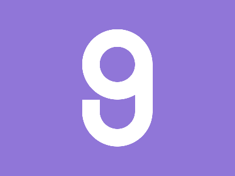

# ✅ CSS Battle Daily Target: 01/06/2025

  
[Play Challenge](https://cssbattle.dev/play/rAF4Ler2ROggUKcCH38k)  
[Watch Solution Video](https://youtube.com/shorts/T4jf-ojJKaU)

---

## 🔢 Stats

**Match**: ✅ 100%  
**Score**: 🟢 669.25 (Characters: 184)

---

## ✅ Code

```html
<p><a>
<style>
*{
  background:#9076D8;
  color:FFF;
  *{
    border:32q solid;
    margin:50 140;
    border-radius:65q
  }
}
  p,a{
    position:fixed
  }
  p{
    color:9076D8;
    border-radius:0;
    margin:30-30
  }
  a{
    padding:30;
    margin:-90-30
  }
</style>
```

---

## ✅ Code Explanation

This challenge displays **three yellow semi-circular arches** over a **lavender purple background**, positioned like a rounded triangle — two at the top and one below in the center.

---

### 🎨 Background and Global Styling

The outer universal selector (`*`) sets the **entire background** to a lavender-purple tone using `#9076D8`. It also sets a `color` property to `FFF`, which becomes the default `border-color` or `box-shadow` color unless overridden.

Inside that, a second nested universal selector applies to **all children**:

* Adds a `border` of `32q` using the current color
* Applies a `margin` of `50 140` to place the elements roughly at center
* Sets a `border-radius` of `65q` to make them **perfectly circular**

This styling affects both `<p>` and `<a>` elements in one go.

---

### 🟡 Upper Arches (Top Two Domes)

The `<a>` tag is used to draw **two large yellow arches**:

* Uses `padding: 30` to control size
* `margin: -90 -30` shifts the circle up and slightly left
* With the previously set circular border and color, it becomes a **yellow-outlined circle**
* But thanks to positioning and layout, only the **bottom half** is visible — creating the **arch effect**
* `scale` isn’t used here; placement alone gives the illusion of symmetry

---

### 🟡 Lower Arch (Single Bottom Dome)

The `<p>` tag creates the third arch:

* Overrides the inherited `color` with the **background color**, `#9076D8`, essentially “cutting out” the top half visually
* Removes circular edges using `border-radius: 0`
* `margin: 30 -30` brings it into position below the other two
* Because the top portion blends into the background, what’s left is a clean **bottom semi-circle**

---

### 🧠 Techniques Used

* **Nested universal selectors** apply global styles in very few characters
* **Circular borders** are used to create clean shapes
* **Strategic margin and padding** control placement and dimensions
* **Color override** with the same as the background acts as a "mask" to hide unwanted edges
* **Only two HTML elements** generate three arches via positioning and reuse