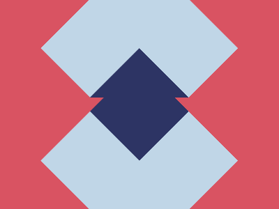

# ✅ CSS Battle Daily Target: 03/06/2025

  
[Play Challenge](https://cssbattle.dev/play/2crTunSUWLDphyKaPABj)  
[Watch Solution Video](https://youtube.com/shorts/yCV6HSCLSMs)

---

## 🔢 Stats

**Match**: ✅ 100%  
**Score**: 🟢 617.06 (Characters: 331)

---

## ✅ Code

```html
<p><p a></p><a><a b><a c>
<style>
*{
  position:fixed;
  background:#D95362
}
  p{
    background:#C0D6E7;
    padding:71+141;
    margin:-10 51;
    clip-path:polygon(25%0,75%0,100%50%,75%100%,25%100%,0%50%)
  }
  [a]{
    margin:152 51
  }
  a{
    background:#2D3464;
    padding:36+71;
    margin:60.5 121;
    clip-path:polygon(50%0,0%100%,100%100%)
  }
  [b]{
    margin:81 121
  }
  [c]{
    scale:-1;
    margin:151 121
  }
</style>
```

---

## ✅ Code Explanation

This challenge displays a **light blue hexagon** centered on a **salmon red background**, with **three dark navy-blue triangles** arranged in a vertical column beneath it. The visual has a symmetrical, stacked shape — almost like a stylized arrow formation.

---

### 🎨 Background Setup

The universal selector `*` is used to:

* Set `position: fixed` for all elements, making it easier to control layout precisely
* Set a **salmon-red background** (`#D95362`) for the entire screen

---

### 🔷 Hexagon (Top Shape)

The first `<p>` element is styled to create a **light blue hexagon** (`#C0D6E7`):

* `padding: 71 + 141` sets its size (`212px`)
* `margin: -10 51` adjusts its position slightly upward and centers it horizontally
* `clip-path: polygon(...)` is used to shape it into a **hexagon** using 6 points:

  * `(25% 0%)`, `(75% 0%)` — top left and right corners
  * `(100% 50%)` — right middle corner
  * `(75% 100%)`, `(25% 100%)` — bottom right and left corners
  * `(0% 50%)` — left middle corner

This creates a flat-topped hexagon centered on the screen.

---

### 🔻 Triangles (Bottom Shapes)

Three `<a>` tags (including the base `<a>` and two with attributes `[b]` and `[c]`) are used to create **three dark blue triangles** (`#2D3464`) positioned in a vertical line.

* Each triangle uses the same `clip-path: polygon(50% 0%, 0% 100%, 100% 100%)` to create a **downward-pointing triangle**
* `padding: 36 + 71` sets the triangle size (107px)
* `margin` values vertically space the triangles:

  * Base `<a>`: `margin: 60.5 121`
  * `[b]`: `margin: 81 121` (above the base)
  * `[c]`: `margin: 151 121` (below the base) with `scale: -1` to **flip it upside down**, creating visual symmetry

This creates a layered, stacked look beneath the hexagon.

---

### 🧠 Techniques Used

* **Attribute selectors** like `[a]`, `[b]`, and `[c]` are used to differentiate triangle positions without adding classes
* **Clip-path** is used to draw both hexagon and triangles purely in CSS
* **Shorthand math** (`71+141`, `36+71`) keeps character count low
* **Element re-use** and smart placement via `margin` and `scale` reduce code redundancy

---

### 🏁 Summary

* Background: Salmon-red using `#D95362`
* Hexagon: Centered, light blue (`#C0D6E7`), clipped with polygon
* Triangles: Three navy-blue shapes below the hexagon, arranged vertically
* Tools: `clip-path`, `margin`, `scale`, and fixed positioning for precision
* Score: 617.06 with just **331 characters**