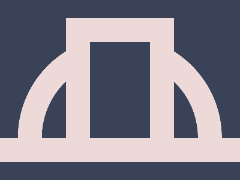

# ✅ CSS Battle Daily Target: 05/06/2025

  
[Play Challenge](http://cssbattle.dev/play/rhgEVf1zxiUqU50PXgFU)  
[Watch Solution Video](https://youtube.com/shorts/W1KPCI67AoE)

---

## 🔢 Stats

**Match**: ✅ 100%  
**Score**: 🟢 660.03 (Characters: 199)

---

## ✅ Code

```html
<p><a><b>
<style>
*{
  background:#394257
}
  p,a,b{
    position:fixed;
    border:43q solid#EED9D9;
    padding:120+210;
    margin:-58
  }
  a{
    border-radius:179q 179q 0 0;
    padding:65+130;
    margin:-50-170
  }
  b{
    padding:80+50;
    margin:-135-90
  }
</style>
```

---

## ✅ Code Explanation

This challenge recreates a visual consisting of **two large concentric rings**, perfectly aligned vertically, on a **dark bluish-gray background**. The design feels soft, symmetric, and minimal.

---

### 🎨 Background

The background is set globally using the universal selector. It uses a **desaturated bluish-gray** (`#394257`) that gives a calm contrast to the light-colored rings.

---

### 🟣 Top and Bottom Rings

Two sets of overlapping tags are used to generate each ring:

* For each ring, three elements (`<p>`, `<a>`, `<b>`) are stacked at the same location.
* All of them share:

  * `position: fixed` for precise placement
  * A **thick border** (`43q`) in a **light pink** (`#EED9D9`)
  * Transparent center using `padding`
  * Negative `margin` to control alignment and overlap
* The elements stack in such a way that they form a **ring**, not a solid disc.

---

### 🟡 Rounded Cap (Top Half)

One of the `<a>` tags has a **top-rounded border-radius** — using large radius values only on the top-left and top-right corners — to create a **half capsule** shape. This smooths the top of the upper ring and contributes to a subtle design touch that enhances the visual rhythm between top and bottom.

---

### 🔳 Inner Ring Control

The `<b>` tag is slightly smaller, with less padding and a different offset. This clever positioning ensures the appearance of a **hollow inner circle** within each ring, thanks to layering of multiple elements with the same border color and background behind them.

---

### 🧠 Techniques Used

* **Minimal HTML elements reused twice** to recreate the same shape vertically
* **Fixed positioning** and **negative margins** for pixel-perfect stacking
* **Padding-based sizing** with `+` math saves characters while defining size
* **Border with radius** to create capsule shapes without additional shapes
* **Overlapping same-colored borders** and precise margining to form clean rings

---

### 🏁 Summary

* **Background**: Dark desaturated blue-gray
* **Visual**: Two vertically stacked pink hollow rings
* **Approach**: Use of shared styles, border thickness, and nested structure
* **Effect**: Clean, minimal, soft-edged geometry
* **Score Achieved**: 100% match using only 199 characters