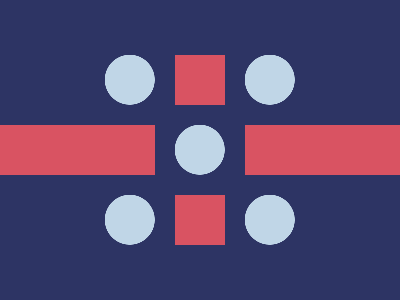

# ✅ CSS Battle Daily Target: 06/06/2025

  
[Play Challenge](https://cssbattle.dev/play/YIf3c1ujLXToXVns07TQ)  
[Watch Solution Video](https://youtube.com/shorts/niRYizo9yp4)

---

## 🔢 Stats

**Match**: ✅ 100%  
**Score**: 🟢 632 (Characters: 265)

---

## ✅ Code

```html
<p><a>
<style>
*{
  background:#2D3464;
  *{
    background:#D95362;
    margin:125 0
  }
}
  p,a{
    position:fixed;
    padding:25;
    margin:-70 175;
    box-shadow:0 148q#D95362,0 76q 0 21q#2D3464
  }
  a{
    background:#C0D6E7;
    border-radius:50%;
    margin:-25-95;
    color:C0D6E7;
    box-shadow:0 148q,148q 148q,148q 0,74q 74q
  }
</style>
```

---

## ✅ Code Explanation

This target displays a **red cross** with **four light blue circles** placed diagonally at the corners of the canvas, all against a **dark navy-blue background**.

---

### 🎨 Background Setup

The base background is set to a deep navy blue (`#2D3464`) using the universal selector.

Inside the universal selector, a nested universal selector targets all child elements and sets their background to **red** (`#D95362`), with a vertical `margin` that helps center the red cross block.

---

### ➕ Red Cross

Two HTML elements (`<p>` and `<a>`) are used to form the vertical and horizontal red bars of the cross.

Each of them:

* Has `position: fixed` for absolute control
* Uses `padding` to control thickness and length
* Is positioned using negative `margin` to center them
* Uses `box-shadow` to duplicate the bars and extend them

This layering technique constructs a **perfect cross** with minimal markup.

Additionally, a `box-shadow` with `blur` is applied using the same background color (`#2D3464`) to **mask overlapping areas** and maintain clean edges.

---

### 🔵 Blue Circles

The `<a>` element (used for the horizontal red bar) also draws **four light blue circles** (`#C0D6E7`) using:

* A new background color
* `border-radius: 50%` for circular shape
* A fresh `box-shadow` declaration with four shadows that place circles at each corner:

  * Top-left, top-right, bottom-right, bottom-left diagonals

The circles don't overlap the red cross due to precise placement using `margin` and offsets.

---

### 🧠 Techniques Used

* **Nested universal selectors** for mass styling with character savings
* **Box-shadow** used for both element replication and masking
* **Fixed positioning** allows pixel-perfect placement
* **Negative margining** aligns everything centrally with minimal math
* **Single element reuse** cuts down on tags while achieving multiple effects

---

### 🏁 Summary

* **Background**: Navy blue
* **Shapes**:

  * Red cross made of two rectangles
  * Four diagonally placed light blue circles
* **Effect**: Geometric, symmetrical and bold
* **Tools**: Nested selectors, `box-shadow`, `border-radius`, and `padding`
* **Score Achieved**: 100% match using only **265 characters**