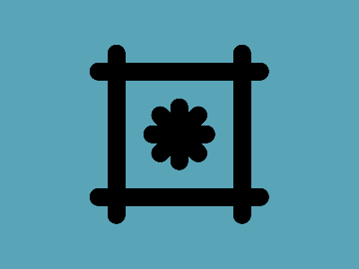

# ✅ CSS Battle Daily Target: 07/06/2025

  
[Play Challenge](https://cssbattle.dev/play/oAJaNdW4iLhnPkP2dKt1)  
[Watch Solution Video](https://youtube.com/shorts/k9MsygJdUP8)

---

## 🔢 Stats

**Match**: ✅ 100%  
**Score**: 🟢 637.63 (Characters: 248)

---

## ✅ Code

```html
<p><a><b><c><c><c>
<style>
*{
  background:#5AA4B7;
  position:fixed;
  border-radius:51q;
  *{
    background:#000
  }
}
  p,a{
    padding:100+10;
    margin:42 112;
    color:000;
    box-shadow:148q 0
  }
  a{
    rotate:90deg;
    margin:-170 60
  }
  b,c{
    padding:40+10;
    margin:-40+60
  }
  c{
    rotate:45deg;
    margin:-40-10
  }
</style>
```

---

## ✅ Code Explanation

This challenge renders a **symmetrical floral-like structure** with **rounded black bars arranged in a plus and X pattern**, all placed on a **light teal background**.

---

### 🎨 Background

The entire canvas is filled with a **soft teal** shade:

```css
background: #5AA4B7;
```

This is applied globally to `*`.

---

### 🔲 Black Rounded Petals (Core Structure)

All child elements are styled to be:

* **Fixed positioned** for exact placement
* **Fully rounded** using `border-radius: 51q`
* Given a **black fill** (`#000`) via the nested universal selector

This gives all elements a **pill-like** look.

---

### ➕ Vertical and Horizontal Bars

`<p>` and `<a>` are used as thick **vertical and horizontal pills**:

* Both have a `padding: 100+10` which gives them a long, pill-like form
* `<p>` is centered with `margin: 42 112`
* `<a>` is **rotated 90 degrees** to become the horizontal bar and slightly repositioned with `margin: -170 60`
* `box-shadow: 148q 0` is applied to each to duplicate them in the opposite direction, forming the full vertical and horizontal lines

---

### ❌ Diagonal Petals (X-shape)

* `<b>` and three `<c>` elements are used to create **diagonal pills**, forming the “X” in the flower
* These elements use `padding: 40+10` to shorten their length compared to the central cross
* The `<c>` elements are **rotated 45 degrees** and **positioned diagonally** using adjusted margins like `-40-10`, creating a neat X-pattern around the center

The use of repeated `<c>` tags allows for symmetrical placement in all four diagonal directions.

---

### 🧠 Techniques Used

* **Nested universal selectors** to efficiently apply global child styles (especially `background`)
* **Rotate transforms** to avoid extra elements or calculations for horizontal/diagonal alignment
* **Fixed positioning** combined with negative `margin` values for pixel-perfect layout
* **Smart reuse** of tags (`<c>`) with varied margins to reduce total characters

---

### 🏁 Summary

* **Background**: Light teal (`#5AA4B7`)
* **Main Elements**: 8 pill-like black shapes arranged in a “+” and “×” pattern
* **Visual Effect**: A flower-like symmetrical figure with soft rounded edges
* **Approach**: Rotation, box-shadow, and element duplication
* **Score Achieved**: ✅ 100% match using only **248 characters**