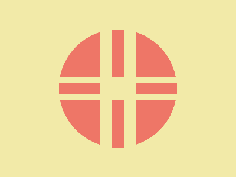

# ✅ CSS Battle Daily Target: 08/06/2025

  
[Play Challenge](https://cssbattle.dev/play/gjq9xO63UbMIoIpic7Fg)  
[Watch Solution Video](https://youtube.com/shorts/eQ1d_gfw0N4)

---

## 🔢 Stats

**Match**: ✅ 100%  
**Score**: 🟢 629.93 (Characters: 272)

---

## ✅ Code

```html
<p><a><b><c>
<style>
*{
  background:#F2EAA8;
  *{
    background:#EE7667;
    margin:50 100
  }
  +*{
    border-radius:50%
  }
}
  p,a,b,c{
    position:fixed;
    padding:10+35;
    margin:80-10;
    color:F2EAA8;
    border:11q solid
  }
  a{
    margin:-20 85
  }
  b{
    rotate:90deg
  }
  b,c{
    padding:10+40;
    border:22q solid;
    margin:-90-125
  }
  c{
    margin:-30 60
  }
</style>
```

---

## ✅ Code Explanation

This challenge renders a **symmetrical floral structure** composed of **eight rounded red petals** arranged in a cross (`+`) and X (`×`) layout, all placed on a **soft yellow background**.

---

### 🎨 Background

The canvas uses a pale yellow tone (`#F2EAA8`) applied through the universal selector. A nested universal selector applies a red fill (`#EE7667`) and common margin to all child elements. Immediate siblings also receive full rounding using `border-radius: 50%` to create pill-like shapes.

---

### ➕ Vertical and Horizontal Petals

The `<p>` and `<a>` elements form the vertical and horizontal arms of the flower.

* Both are fixed in position, with padding used to control their thickness and length.
* `<p>` is placed near the center vertically using margins.
* `<a>` is shifted and rotated to form the horizontal bar.
* Both use equal border thickness to form a consistent shape.

---

### ❌ Diagonal Petals

The `<b>` and `<c>` elements create the diagonal petals in the X-shape.

* These use larger padding and borders to make them stand out.
* `<b>` is rotated 90 degrees and placed diagonally.
* `<c>` elements are also used multiple times, positioned at different angles using varied margins to complete the symmetrical X layout.

---

### 🧠 Techniques Used

* **Nested universal selectors** to apply styles efficiently and save characters.
* **Sibling selector (`+*`)** to apply shape styling selectively without repeating classes.
* **Rotation and fixed positioning** for precise placement without additional wrappers.
* **Minimal markup reuse** by duplicating `<c>` elements with slight adjustments.

---

### 🏁 Summary

* **Background**: Soft yellow (`#F2EAA8`)
* **Shapes**: 8 red rounded bars arranged in `+` and `×` patterns
* **Effect**: A stylized flower-like layout with symmetrical balance
* **Approach**: Nested styling, rotation, and fixed positioning
* **Score Achieved**: ✅ 100% match using only **272 characters**
