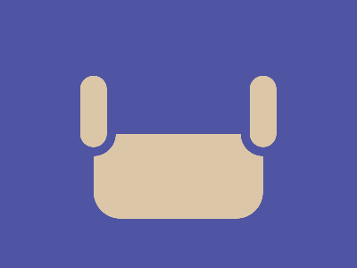

# ✅ CSS Battle Daily Target: 09/06/2025

  
[Play Challenge](https://cssbattle.dev/play/jMuBUSMPP6d2aWgFhtuc)  
[Watch Solution Video](https://youtube.com/shorts/bbNQXtetB2M)

---

## 🔢 Stats

**Match**: ✅ 100%  
**Score**: 🟢 673.33 (Characters: 178)

---

## ✅ Code

```html
<p><a>
<style>
*{
  background:#4F55A2;
  *{
    background:#DCC6A8;
    border-radius:32q;
    margin:150 105 55
  }
}
  p,a{
    position:fixed;
    padding:40+15;
    margin:-75-25;
    border:11q solid#4F55A2
  }
  a{
    margin:-50 165
  }
</style>
```

---

## ✅ Code Explanation

This challenge replicates two **rounded vertical bars** side by side on a **purple-blue background**, forming a minimalistic and balanced composition.

---

### 🎨 Background

The entire canvas uses a rich **indigo-purple** shade (`#4F55A2`) applied globally through the `*` selector. Inside the nested universal selector, all elements are given a **light beige** background (`#DCC6A8`), consistent border-radius for rounded shapes, and margin for spacing.

---

### 🟫 Rounded Pill Shapes

The two `<p>` and `<a>` tags represent tall **pill-shaped elements**.

* Both are styled with `position: fixed` to enable exact placement.
* `padding` values extend the height, giving a vertical pill appearance.
* `border-radius` ensures rounded ends.
* A border with the background color (`#4F55A2`) creates spacing around each shape, separating them visually from the background.
* The `<p>` element is placed slightly to the left using negative margins.
* The `<a>` element is pushed to the right with adjusted margin values to align both symmetrically.

---

### 🧠 Techniques Used

* **Nested universal selectors** for reducing repetition and applying shared styles compactly.
* **Precise fixed positioning** using `margin` for accurate layout.
* **Background-color borders** to simulate spacing without extra elements or wrappers.
* **Efficient element reuse** with minimal HTML markup to maintain a low character count.

---

### 🏁 Summary

* **Background**: Purple-blue (`#4F55A2`)
* **Shapes**: Two tall beige rounded bars placed side by side
* **Effect**: Clean, symmetrical structure with soft contrast
* **Approach**: Minimal elements, precise placement, smart reuse of styles
* **Score Achieved**: ✅ 100% match using only **178 characters**
