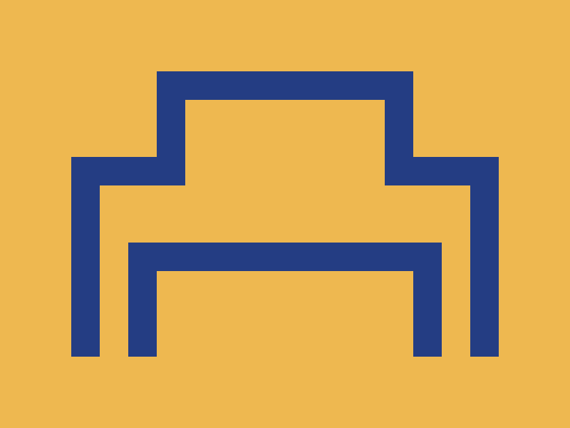

# ✅ CSS Battle Daily Target: 10/06/2025

  
[Play Challenge](https://cssbattle.dev/play/um7i7cUKqD7IVLYsP486)  
[Watch Solution Video](https://youtube.com/shorts/r5B007O3oKs)

---

## 🔢 Stats

**Match**: ✅ 100%  
**Score**: 🟢 679.9 (Characters: 169)

---

## ✅ Code

```html
<p><a>
<style>
*{
  background:#EEB850;
  *{
    border:22q solid#243D83;
    border-bottom:0;
    margin:110 50 50
  }
}
  p,a{
    position:fixed;
    padding:30+90;
    margin:40 20
  }
  a{
    padding:30+70;
    margin:-170-90
  }
</style>
```

---

## ✅ Code Explanation

This challenge creates two **dark blue “incomplete rectangles”** (U-shapes without the bottom border), arranged on a **yellow-orange background**, one in the bottom right and one in the top left.

---

### 🎨 Background

The base canvas is styled with a **yellow-orange** background (`#EEB850`) applied globally using the universal `*` selector.

Inside a nested universal selector, all child elements are given:

* A **22q solid border** in **dark blue** (`#243D83`)
* No **bottom border** (`border-bottom: 0`) to create the U-shape effect
* A default `margin` to position them initially (`margin: 110 50 50`)

---

### 🟦 U-Shaped Frames

The two elements, `<p>` and `<a>`, represent the **top-left** and **bottom-right** U-shaped frames:

* Both are `fixed` in position to allow precise placement.
* `<p>` is sized and positioned near the top-left corner using `padding: 30+90` and `margin: 40 20`.
* `<a>` uses slightly smaller dimensions (`padding: 30+70`) and a large **negative margin** (`margin: -170 -90`) to move it toward the bottom-right.

These elements reuse the same styles inherited from the nested universal selector but are individually adjusted for positioning and size.

---

### 🧠 Techniques Used

* **Nested universal selectors** to apply common styles (border and positioning) compactly.
* **Fixed positioning** and `margin` tricks for precise placement across the canvas.
* **Use of negative margins** to shift elements to desired screen locations without extra wrappers.
* **Simulated shapes** using selectively removed borders (no bottom border creates open rectangles).

---

### 🏁 Summary

* **Background**: Warm yellow-orange (`#EEB850`)
* **Shapes**: Two blue U-shaped open rectangles
* **Effect**: Diagonal composition with clean contrast
* **Approach**: Shared styling with nested selectors, precise positioning, border manipulation
* **Score Achieved**: ✅ 100% match using only **169 characters**
