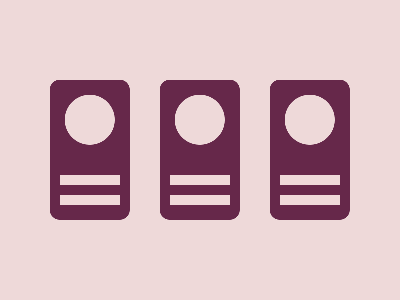

# ✅ CSS Battle Daily Target: 11/06/2025

  
[Play Challenge](https://cssbattle.dev/play/o5XdEViDmsXrAE0T80BY)  
[Watch Solution Video](https://youtube.com/shorts/w-VWzgm3TvY)

---

## 🔢 Stats

**Match**: ✅ 100%  
**Score**: 🟢 630.51 (Characters: 270)

---

## ✅ Code

```html
<p><a><b>
<style>
*{
  background:#EED9D9;
  *{
    background:#66284A;
    margin:80 160;
    color:66284A;
    box-shadow:116q 0,-116q 0
  }
  +*{
    border-radius:11q
  }
}
  p,a,b{
    position:fixed;
    background:#EED9D9;
    color:EED9D9;
    padding:25;
    margin:15
  }
  p{
    border-radius:50%
  }
  a,b{
    padding:5+30;
    margin:55-30
  }
  b{
    margin:15-30
  }
</style>
```

---

## ✅ Code Explanation

This challenge creates a **three-dot layout**: a **central circle** flanked by two **pill-shaped bars** on the left and right, all placed on a **light pink background**.

---

### 🎨 Background

The entire canvas is styled with a **light pink** background (`#EED9D9`) using the global `*` selector.

Inside a **nested universal selector**:

* Elements get a **dark plum** fill (`#66284A`)
* Shared spacing via `margin: 80 160`
* `box-shadow: 116q 0, -116q 0` duplicates elements horizontally for symmetry
* `+*` applies `border-radius: 11q` to siblings, rounding ends for the pill effect

---

### ⚫ Center Circle and Pill Bars

Three elements are used:

* `<p>` creates the **central circle** using `padding: 25`, `border-radius: 50%`, and is recolored with the background to cut through the plum base
* `<a>` and `<b>` create the **vertical pill bars**, slightly taller and thinner (`padding: 5+30`)
* Their margins (`55 -30` for `<a>` and `15 -30` for `<b>`) adjust their vertical alignment

Each of these is duplicated to the left and right using `box-shadow`, forming symmetrical pairs on both sides.

---

### 🧠 Techniques Used

* **Nested universal selectors** to keep character count low while applying global child styles
* **Fixed positioning** to anchor shapes accurately
* **`box-shadow` cloning** to duplicate shapes horizontally without additional HTML
* **Color tricks** (foreground matches background) to "cut out" or mask parts (the central circle)

---

### 🏁 Summary

* **Background**: Light pink (`#EED9D9`)
* **Shapes**: Central circle flanked by two vertical pill bars, duplicated on both sides
* **Effect**: Symmetrical triple-column composition with a “hole” in the center
* **Approach**: Shadow cloning, nested styles, and fixed placement
* **Score Achieved**: ✅ 100% match using only **270 characters**
