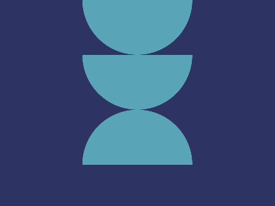

# ✅ CSS Battle Daily Target: 12/06/2025

  
[Play Challenge](https://cssbattle.dev/play/E9dPyo7ZbeuFZFaO1mIn)  
[Watch Solution Video](https://youtube.com/shorts/sIc_jPHwNW4)

---

## 🔢 Stats

**Match**: ✅ 100%  
**Score**: 🟢 688.73 (Characters: 158)

---

## ✅ Code

```html
<p><a><b>
<style>
*{
  background:#2D3464
}
  p,a,b{
    position:fixed;
    background:#5AA4B7;
    padding:40+80;
    border-radius:0 0 99q 99q;
    margin:-8 112
  }
  a,b{
    margin:40-80
  }
  b{
    scale:-1
  }
</style>
```

---

## ✅ Code Explanation

This challenge creates **three sky-blue arches** (semicircles) arranged side by side on a **deep indigo background**.

---

### 🎨 Background

The entire canvas uses a **dark indigo color** (`#2D3464`), applied globally using the universal selector. This sets the stage for the lighter-colored arch shapes to visually pop out.

---

### 🏛️ Arch Shapes

The elements `<p>`, `<a>`, and `<b>` are used to form the arches. Each is positioned using `position: fixed`, given a **sky-blue background** (`#5AA4B7`), and styled with `padding: 40+80`, making them tall and wide blocks.

The arches are achieved by setting the `border-radius` to `0 0 99q 99q`, which rounds only the bottom corners of each block. This creates a clean arch effect without needing extra elements.

The `<p>` tag is centered using `margin: -8 112`, aligning it horizontally and vertically. The other two elements (`<a>` and `<b>`) are pushed outward using `margin: 40 -80`, placing them to the left and right.

---

### ➡️ Mirrored Element

To balance the layout, the third element (`<b>`) is flipped horizontally using `scale: -1`. This doesn’t visually change the shape because it's symmetric, but it saves characters and keeps the layout tight.

---

### 🧠 Techniques Used

* A single property (`border-radius`) is cleverly used to simulate semicircles.
* Fixed positioning with fine-tuned margins ensures precise placement.
* The `scale` trick mirrors an element without changing its appearance but helps with brevity.
* Minimal HTML (just three tags) achieves a perfect match.

---

### 🏁 Summary

* **Background**: Deep indigo (`#2D3464`)
* **Shapes**: Three sky-blue arches with rounded bottoms
* **Effect**: Balanced, arcade-style layout with symmetrical forms
* **Approach**: Smart use of padding, border-radius, and scale for efficient layout
* **Score Achieved**: ✅ 100% match using only **158 characters**
