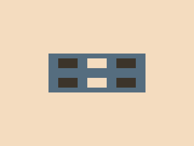

# ✅ CSS Battle Daily Target: 17/06/2025

  
[Play Challenge](https://cssbattle.dev/play/j8oIHllnFNB1EED2LAYL)  
[Watch Solution Video](https://youtube.com/shorts/K4UtMHkt-fk)

---

## 🔢 Stats

**Match**: ✅ 100%  
**Score**: 🟢 661.77 (Characters: 196)

---

## ✅ Code

```html
<p>
<style>
*{
  background:#F4DCBF;
  *{
    background:#556D7F;
    margin:110 100
  }
}
  p{
    position:fixed;
    padding:10+20;
    background:#F4DCBF;
    margin:10 80;
    color:3C342A;
    box-shadow:0 42q#F4DCBF,64q 0,64q 42q,-64q 0,-64q 42q
  }
</style>
```

---

## ✅ Code Explanation

This challenge features **five dark blocks** arranged in a symmetric, grid-like pattern over a **light peach background**. The central block is replaced with the same background color to create a hole, giving a "dice face" layout.

---

### 🎨 Background

The global `*` selector sets the **canvas background** to a soft **peach color** (`#F4DCBF`). This forms the base layer on which other elements are visually built.

Inside a **nested universal selector**, the child element (`<p>`) is styled with a **gray-blue background** (`#556D7F`) and a `margin` that initially positions it roughly in the center.

---

### ⬛ Grid of Blocks

The `<p>` tag is styled using `position: fixed` and further adjusted with a new margin to align it precisely in the upper center of the canvas.

The shape's size is controlled with `padding: 10+20`, creating a small rectangular block. The background color is overridden again to `#F4DCBF`, and the `color` is changed (though `color` isn’t needed here—it likely just helps save characters for compression quirks).

To **replicate the grid layout**, the `box-shadow` property is used:

* `0 42q #F4DCBF` overlays a lighter square (matching the background) directly beneath the main square to **simulate a gap** or "hole."
* The other shadows — `64q 0`, `64q 42q`, `-64q 0`, `-64q 42q` — replicate the original block at specific offsets to the left, right, and below. This creates the effect of a **2x3 grid**, with the middle block of the top row left blank via the light-colored shadow.

---

### 🧠 Techniques Used

* **Nested universal selectors** apply styles to both root and child levels with minimal characters.
* **Box-shadow cloning** efficiently duplicates elements without extra HTML.
* **Negative space simulation** by matching the background color (creates an illusion of removed elements).
* **Single-element replication** is a classic CSS Battle move to reduce markup and character count.

---

### 🏁 Summary

* **Background**: Light peach (`#F4DCBF`)
* **Shapes**: Five dark squares forming a grid with a central "hole"
* **Effect**: Structured, symmetric dice-face layout
* **Approach**: Smart use of shadows, nesting, and overlapping to minimize characters and markup
* **Score Achieved**: ✅ 100% match using only **196 characters**