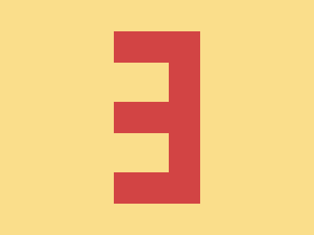

# ✅ CSS Battle Daily Target: 18/06/2025

  
[Play Challenge](https://cssbattle.dev/play/1mmGpHvUAIxTZ5xSLujV)  
[Watch Solution Video](https://youtube.com/shorts/rWvbP8NpeyI)

---

## 🔢 Stats

**Match**: ✅ 100%  
**Score**: 🟢 712.6 (Characters: 133)

---

## ✅ Code

```html
<p>
<style>
*{
  background:#FADE8B;
  +*{
    background:#D24444;
    margin:40 145
  }
}
  p{
    position:fixed;
    padding:25+35;
    margin:40+0;
    box-shadow:0 95q#FADE8B
  }
</style>
```

---

## ✅ Code Explanation

This challenge forms **two red rectangles** (pillars) stacked vertically on a **yellow background**, with a **gap between them**, creating a bold, minimalistic geometric look.

---

### 🎨 Background

The entire canvas uses a **warm yellow** (`#FADE8B`), applied globally using the `*` selector. This serves as the foundation color for the design.

---

### 🟥 Vertical Pillars

A single `<p>` element is used, and its background is changed using a sibling selector (`+*`) in the `*` rule. This applies a **red fill** (`#D24444`) along with `margin: 40 145`, placing the red block horizontally centered.

To **create the second (lower) red rectangle**, the code uses a `box-shadow`:

* `box-shadow: 0 95q #FADE8B` draws a rectangle directly **below** the original one, but in the **same yellow as the background**.
* This overlays a yellow block between the two red ones, **creating a clean gap** — even though only **one red element** exists in the HTML.

---

### 🧠 Techniques Used

* **Sibling selector `+*`** applies styles to the first HTML element after `<style>`, saving characters and avoiding class or tag selectors.
* **`box-shadow` for masking** — applying the background color strategically to "erase" a portion of the shape, giving the illusion of a gap.
* **Efficient layout** using fixed positioning and carefully calculated margin and padding to center everything accurately.
* Achieving **multiple shapes from one element** is a classic CSS Battle trick, key to hitting low character counts.

---

### 🏁 Summary

* **Background**: Yellow (`#FADE8B`)
* **Shapes**: Two red vertical rectangles with a clean gap between
* **Effect**: Minimalist, symmetrical split-bar look
* **Approach**: Use of box-shadow to mask part of the block and simulate separation
* **Score Achieved**: ✅ 100% match using only **133 characters**