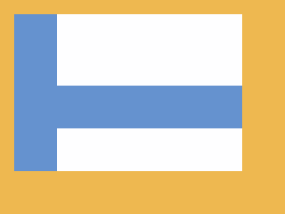

# ✅ CSS Battle Daily Target: 20/06/2025

  
[Play Challenge](https://cssbattle.dev/play/cWfGYKqrpqbCmDs1qoKx)  
[Watch Solution Video](https://youtube.com/shorts/3yidVVZU1vU)

---

## 🔢 Stats

**Match**: ✅ 100%  
**Score**: 🟢 679.14 (Characters: 170)

---

## ✅ Code

```html
<p><a>
<style>
*{
  background:#EEB850;
  *{
    background:#6592CF;
    margin:20 60 60 20
  }
}
  p,a{
    position:fixed;
    background:#FEFEFF;
    padding:50+130;
    margin:0 60
  }
  a{
    padding:30+130;
    margin:110-130
  }
</style>
```

---

## ✅ Code Explanation

This challenge displays **two rounded vertical blue bars**, one larger and one smaller, stacked vertically on a **warm orange background**.

---

### 🎨 Background

The canvas is styled with a **golden orange** background (`#EEB850`) using the universal selector. Inside a nested universal selector, child elements get a **blue fill** (`#6592CF`) and consistent margins to space them evenly from the edges.

---

### 🟦 White Capsules

The two elements `<p>` and `<a>` create large **white vertical capsules** that act as cutouts.

* Both are `fixed` in position with white backgrounds (`#FEFEFF`).
* They use large horizontal padding (`+130`) to give them a pill-like appearance.
* The `<p>` element is taller (`padding: 50+130`) and centered toward the top with `margin: 0 60`.
* The `<a>` element is slightly shorter (`padding: 30+130`) and placed below with `margin: 110 -130`.

These white capsules overlap the blue background to **create the illusion of a gap** in the blue base.

---

### 🧠 Techniques Used

* **Nested universal selectors** apply background and margin to all nested elements efficiently.
* **Fixed positioning** with carefully calculated margins and padding controls placement and shape.
* **No extra HTML needed** — only two elements are used to create the entire structure.
* **Layering of colors** (white on blue) simulates complex shapes with simple blocks.

---

### 🏁 Summary

* **Background**: Warm orange (`#EEB850`)
* **Shapes**: Two vertical capsules stacked with white fill
* **Effect**: Clean modern look with cutout-style central shapes
* **Approach**: Minimal HTML, smart layering, and spacing tricks
* **Score Achieved**: ✅ 100% match using only **170 characters**