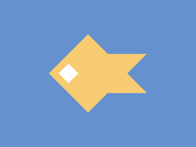

# ✅ CSS Battle Daily Target: 21/06/2025

  
[Play Challenge](https://cssbattle.dev/play/S9P3lP0F98oHl7y6Iq2U)  
[Watch Solution Video](https://youtube.com/shorts/EUOA_eLbh5s)

---

## 🔢 Stats

**Match**: ✅ 100%  
**Score**: 🟢 652.03 (Characters: 214)

---

## ✅ Code

```html
<p>
<style>
*{
  background:#6592CF;
  +*{
    background:#F7CB71;
    margin:70 100;
    clip-path:polygon(60% 25%, 100% 25%, 80% 50%, 100% 75%, 60% 75%, 40% 100%, 0 50%, 40% 0)
  }
}
  p{
    position:fixed;
    padding:14;
    background:#FEFEFF;
    margin:66 26;
    rotate:45deg
  }
</style>
```

---

## ✅ Code Explanation

This challenge creates a **single, centrally placed star-like yellow shape** over a **blue background**, with a **small white square rotated at the center**, giving a layered geometric look.

---

### 🎨 Background

The canvas uses a **blue tone** (`#6592CF`) set via the universal selector. This forms the backdrop for the other elements.

---

### ⭐ Star-Like Yellow Shape

The yellow star is created using the `+*` selector applied to the first element after `<style>`. It uses:

* A `clip-path` polygon to define a custom 8-point shape, resembling a spiky star or rotated octagon.
* The background is set to **yellow-orange** (`#F7CB71`).
* A margin of `70 100` places the shape in the center of the canvas.

The `clip-path` allows defining precise points to form the spiky structure without needing multiple HTML elements.

---

### ◼️ Center Rotated Square

The `<p>` element creates a small **white square** placed over the yellow shape:

* It uses `padding: 14` to define its size and is rotated using `rotate: 45deg` to create a diamond effect.
* It's positioned precisely at the center using `margin: 66 26`.
* Background is white (`#FEFEFF`), giving visual contrast against the yellow backdrop.

---

### 🧠 Techniques Used

* **`clip-path`** enables creating a custom star-like shape with a single HTML element.
* **Sibling selector `+*`** targets the main decorative shape while keeping HTML minimal.
* **Rotation transform** (`rotate`) helps simulate diamond or rotated square without additional markup.
* **Fixed positioning and margin adjustments** ensure pixel-perfect placement.

---

### 🏁 Summary

* **Background**: Blue (`#6592CF`)
* **Shapes**: One yellow star-like polygon and one white rotated square
* **Effect**: Layered, clean, and geometric
* **Approach**: `clip-path` for custom shapes, rotation for orientation, minimal markup
* **Score Achieved**: ✅ 100% match using only **214 characters**