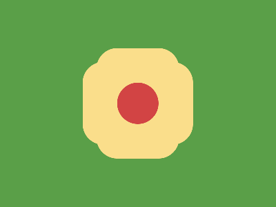

# ✅ CSS Battle Daily Target: 23/06/2025

  
[Play Challenge](https://cssbattle.dev/play/xOUPIcxfaYWRfFkJZbrd)  
[Watch Solution Video](https://youtube.com/shorts/QdzXEvfmCLo)

---

## 🔢 Stats

**Match**: ✅ 100%  
**Score**: 🟢 664.17 (Characters: 192)

---

## ✅ Code

```html
<p><a><b>
<style>
*{
  background:#5A9F48;
  position:fixed;
  border-radius:32q
}
  p,a{
    background:#FADE8B;
    padding:80+60;
    margin:62 132
  }
  a{
    rotate:90deg;
    margin:-80-60
  }
  b{
    padding:30;
    background:#D24444;
    margin:-30
  }
</style>
```

---

## ✅ Code Explanation

This challenge features a **yellow plus symbol** with **rounded ends**, centered on a **green background**, and a **red circle** perfectly overlapping its center — giving a clean, bold appearance.

---

### 🎨 Background

The entire canvas uses a **green** background (`#5A9F48`), set via the universal `*` selector. All elements are also positioned using `fixed` for pixel-perfect placement and use `border-radius: 32q` to make their ends fully rounded.

---

### ➕ Yellow Plus Symbol

The plus sign is built using two HTML elements: `<p>` for the vertical bar and `<a>` for the horizontal bar.

* Both have a **yellow fill** (`#FADE8B`).
* They are large pill shapes created using `padding: 80+60`, making them tall and wide.
* `<p>` is placed at the center with `margin: 62 132`, forming the vertical bar.
* `<a>` is rotated 90 degrees (`rotate: 90deg`) and offset using `margin: -80 -60` to intersect the vertical bar perfectly, forming the horizontal bar.

Together, they form a symmetric yellow cross with smooth, pill-like ends.

---

### 🔴 Red Center Circle

The `<b>` element adds a **red circle** (`#D24444`) at the center of the plus:

* It uses `padding: 30` to size it evenly.
* Placed using `margin: -30`, which puts it directly over the center of the cross.
* Since it shares the same `border-radius: 32q`, it appears perfectly round.

This red dot hides the overlap between the bars and brings visual depth to the plus.

---

### 🧠 Techniques Used

* **Element reuse** to form both arms of the cross without extra markup.
* **Rotation and padding** to simulate width/height efficiently.
* **Overlapping circle** masks intersection and enhances symmetry.
* **Fixed positioning** and `margin` tweaking for precise central alignment.
* **Rounded corners** via `border-radius` make all shapes appear soft and uniform.

---

### 🏁 Summary

* **Background**: Green (`#5A9F48`)
* **Shapes**: Yellow plus sign with a red circle at the center
* **Effect**: Clean, bold, and geometrically balanced layout
* **Approach**: Efficient element reuse with rotation, layering, and precise placement
* **Score Achieved**: ✅ 100% match using only **192 characters**