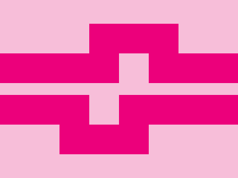

# ✅ CSS Battle Daily Target: 24/06/2025

  
[Play Challenge](https://cssbattle.dev/play/7nlhjaKjtugzgYJHs0vU)  
[Watch Solution Video](https://youtube.com/shorts/4ItrUsRfI7Q)

---

## 🔢 Stats

**Match**: ✅ 100%  
**Score**: 🟢 656.15 (Characters: 206)

---

## ✅ Code

```html
<p><a>
<style>
  *{
    background:#F7BED9
  }
  p,a{
    position:fixed;
    background:#EC007B;
    padding:25+100;
    margin:82-8;
    color:EC007B;
    box-shadow:212q 70px
  }
  a{
    padding:25+75;
    margin:-75 50;
    box-shadow:106q 50px,-159q 120px,-53q 170px
  }
</style>
```

---

## ✅ Code Explanation

This challenge features a **pink canvas** with **multiple magenta rounded vertical bars**, arranged in a rhythmic, cascading pattern across the screen. The layout has a dynamic, offset feel while maintaining balance.

---

### 🎨 Background

The entire canvas is filled with a **light pink color** (`#F7BED9`), set globally using the universal `*` selector. This gives a soft and warm base tone.

---

### 🟣 Vertical Magenta Pillars

Two elements — `<p>` and `<a>` — are reused with different `padding`, `margin`, and `box-shadow` values to simulate **seven rounded bars** arranged in columns and rows.

---

#### `<p>` Element:

* Styled with a **magenta background** (`#EC007B`).
* Uses `padding: 25+100` to create a tall pill shape.
* Positioned near the center with `margin: 82 -8`.
* The `box-shadow` property clones it:

  * `212q 70px` shifts the clone far right and slightly down.

#### `<a>` Element:

* Slightly shorter version using `padding: 25+75`.
* Shifted upwards and right with `margin: -75 50`.
* The `box-shadow` adds three clones:

  * `106q 50px` – near right
  * `-159q 120px` – far left and down
  * `-53q 170px` – center-left and further down

These shadow clones form a **scattered vertical rhythm**, simulating a sequence of differently placed bars using minimal HTML.

---

### 🧠 Techniques Used

* **Box-shadow duplication**: Efficiently multiplies shapes without extra elements.
* **Padding + fixed positioning**: Shapes are scaled precisely and locked in place.
* **Negative margins and sub-pixel values**: Fine-tune layout with precise control.
* **Color layering**: Bold magenta over soft pink enhances contrast with minimal code.

---

### 🏁 Summary

* **Background**: Light pink (`#F7BED9`)
* **Shapes**: Seven magenta vertical pills arranged in an asymmetric but balanced layout
* **Effect**: Stylish vertical rhythm with a sense of motion
* **Approach**: Minimal elements, smart use of `box-shadow` for layout cloning
* **Score Achieved**: ✅ 100% match using only **206 characters**