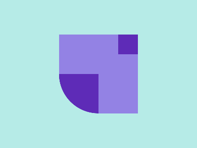

# ✅ CSS Battle Daily Target: 25/06/2025

  
[Play Challenge](https://cssbattle.dev/play/xAWKZ9Br5dl280jldTfe)  
[Watch Solution Video](https://youtube.com/shorts/manaIPLqHsU)

---

## 🔢 Stats

**Match**: ✅ 100%  
**Score**: 🟢 655.09 (Characters: 208)

---

## ✅ Code

```html
<p><a>
<style>
*{
  background:#B6EBE7;
  *{
    background:#9382E4;
    margin:70 120
  }
  +*{
    border-radius:0 0 0 85q
  }
}
  p,a{
    position:fixed;
    padding:20;
    background:#5E2BB7;
    margin:0 120
  }
  a{
    padding:40;
    margin:60-140;
    border-radius:0 0 0 85q
  }
</style>
```

---

## ✅ Code Explanation

This challenge features a **cyan background** with two **purple corner shapes** — one in the **top left** and one in the **bottom right**, forming a symmetric layout with curved cut-outs in opposite corners.

---

### 🎨 Background

The entire canvas is filled with a **soft cyan** color (`#B6EBE7`), applied globally using the universal `*` selector. This acts as the canvas base and visual negative space.

---

### 🟪 Purple Corner Blocks

Two elements are used: `<p>` and `<a>`, both styled with **dark purple** (`#5E2BB7`) and positioned using `fixed`.

---

#### `<p>` Element:

* Square shape with `padding: 20`, positioned at the **top left** using `margin: 0 120`.
* It has **no rounded corner**, just a plain square.
* Acts as the upper corner block.

---

#### `<a>` Element:

* Larger square using `padding: 40`.
* Positioned in the **bottom right corner** using `margin: 60 -140`.
* Styled with `border-radius: 0 0 0 85q`, which rounds the **top-right corner**, giving the distinct cut-out look.

This combination of a **small square in the top left** and a **rounded large block in the bottom right** mirrors across the diagonal, producing a balanced cornered layout.

---

### 🧠 Techniques Used

* **Nested universal selectors** simplify applying background and base margin styles with minimal characters.
* **Sibling selector `+*`** efficiently applies specific styling (like `border-radius`) to just the second element without additional selectors.
* **Fixed positioning** ensures both blocks are accurately placed on the canvas.
* **Quarter-circle effect** is achieved through strategic `border-radius`.

---

### 🏁 Summary

* **Background**: Cyan (`#B6EBE7`)
* **Shapes**: Two purple corner blocks with asymmetric sizing and one curved corner
* **Effect**: Minimalist, diagonally balanced corner layout
* **Approach**: Minimal markup, precise layout control via padding, margin, and radius
* **Score Achieved**: ✅ 100% match using only **208 characters**