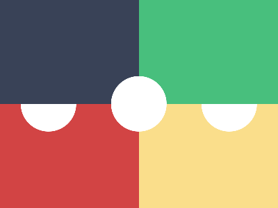

# ✅ CSS Battle Daily Target: 29/06/2025

  
[Play Challenge](https://cssbattle.dev/play/nJyGqyDaZqTbG2DG8qrC)  
[Watch Solution Video](https://youtube.com/shorts/ukl166k4y_g)

---

## 🔢 Stats

**Match**: ✅ 100%  
**Score**: 🟢 625.95 (Characters: 287)

---

## ✅ Code

```html
<p><a><b>
<style>
*{
  background:linear-gradient(to left,#FADE8B 50%,#D24444 0)
}
  p,a,b{ 
    position:fixed
  }
  p,b{
    padding:40;
    background:#FFF;
    border-radius:50%;
    margin:102 22;
    box-shadow:275q 0#FFF
  }
  a{
    padding:75+200;
    background:linear-gradient(to left,#48BF7D 50%,#394257 0);
    margin:-150-70
  }
  b{
    margin:35-40
  }
</style>
```

---

## ✅ Code Explanation

This challenge presents a visually balanced design featuring a **vertically split background** — yellow on the left and red on the right. At the center, there's a **horizontal pill-shaped capsule** with two distinct colors: green on the left and dark blue on the right. On either end of this capsule are **white circular caps**, giving the design a polished, symmetrical look.

---

### 🎨 Background

The background is created using a **linear gradient that splits the canvas vertically**. The left half is filled with a soft yellow (`#FADE8B`) and the right half with red (`#D24444`). The gradient direction is set to go from right to left to achieve this split with minimal characters.

---

### 🟩 Capsule Body

The horizontal capsule in the center is made with a tall and wide rectangle styled to appear pill-shaped. This shape uses another **linear gradient**, splitting the capsule's background color horizontally into green on the left (`#48BF7D`) and dark blue on the right (`#394257`). Padding is used to give it a thick, rounded shape, and it is centered on the screen using fixed positioning and carefully tuned negative margins.

---

### ⚪ End Caps

The white circles at each end of the capsule are created using a clever combination of a base circle and a `box-shadow`. One element is used to place a white circle at the left end, and its box-shadow duplicates the same circle at the right end. This trick helps keep the HTML minimal while achieving the mirrored cap effect.

A secondary element is included with slightly adjusted margins to help align everything precisely — likely for sub-pixel accuracy required for a perfect match in CSS Battle.

---

### 🧠 Techniques Used

* **Gradient backgrounds** are used both for the canvas and for coloring the pill horizontally, allowing two-tone color schemes with no extra elements.
* **Box-shadow cloning** is used to duplicate the white end caps with one element.
* **Padding and border-radius** create soft, pill-like shapes.
* **Fixed positioning and margin tuning** are used for exact alignment and centering.

---

### 🏁 Summary

* The background is a vertical split of yellow and red.
* The central capsule is horizontally split into green and dark blue.
* Two white end caps complete the pill design with a clean, symmetric look.
* The layout is accomplished using gradients, box-shadow tricks, and precise placement.
* Achieved a perfect match with only 287 characters — efficient and elegant.