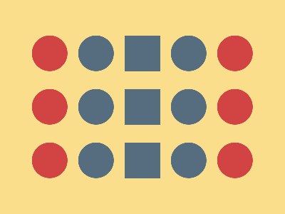

# ✅ CSS Battle Daily Target: 30/06/2025

  
[Play Challenge](https://cssbattle.dev/play/MDtNGE9Sev1z7Xa6QL0s)  
[Watch Solution Video](https://youtube.com/shorts/eThRQuUIdHg)

---

## 🔢 Stats

**Match**: ✅ 100%  
**Score**: 🟢 640.23 (Characters: 241)

---

## ✅ Code

```html
<p><a><b><c><d>
<style>
*{
  background:#FADE8B;
  position:fixed
}
p,a,b,c,d{
  background:#556D7F;
  padding:25;
  margin:42 167;
  color:556D7F;
  box-shadow:0 79q,0 159q
}  
  a,b,c,d{
    border-radius:50%;
    margin:-25 40
  }
  b,c{
    background:#D24444;
    color:D24444
  }
  c{
    margin:-25-285
  }
</style>
```

---

## ✅ Code Explanation

This challenge displays a **stack of three dark blue squares** arranged vertically. On each side of these squares are **alternating red and blue circular dots**, giving a clean, symmetrical layout over a **yellow background**.

---

### 🎨 Background

The canvas uses a soft **yellow tone** (`#FADE8B`) applied to all elements via the universal selector. This serves as the base background for the entire layout.

---

### 🟦 Vertical Squares

The central vertical column of **three dark blue squares** is created using a single element styled with a square shape and a `box-shadow`. The first square is positioned near the top, and the other two are duplicated below it using vertical `box-shadow` offsets. This keeps the HTML minimal while ensuring perfect alignment and spacing.

---

### 🔴 and 🔵 Side Circles

The circular dots on each side of the central stack are built using additional elements. Each of these elements is styled as a **circle using `border-radius`**, and then duplicated vertically using `box-shadow` just like the squares.

* One element places two **blue circles** to the **right** of the squares.
* Another places **red circles** to the **left**, by shifting them with a large negative horizontal margin.

The colors are alternated by using separate elements and adjusting their margins and `background` values. The exact positioning ensures perfect alignment alongside the stacked squares.

---

### 🧠 Techniques Used

* **Single element with `box-shadow`** is used to create multiple copies of the same shape.
* **Circular and square shapes** are built using `padding` with fixed aspect ratios and `border-radius`.
* **Precise spacing** is achieved with carefully tuned `margin` values.
* **Color alternation** is handled using separate elements with overridden `background` and `color` values.

---

### 🏁 Summary

* The background is a soft yellow.
* Three vertically aligned dark blue squares form the core of the composition.
* Red and blue circular dots are placed on the left and right sides of the stack, alternating positions.
* The layout uses clever layering, shadow cloning, and positioning tricks to stay efficient.
* Achieved a 100% match using only **241 characters** — clean and smart.