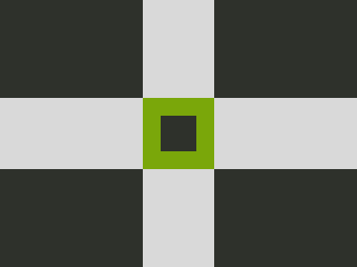

# ✅ CSS Battle Daily Target: 09/07/2025

  
[Play Challenge](https://cssbattle.dev/play/jj7YQvOtHuqRHcnRxYls)  
[Watch Solution Video](https://youtube.com/shorts/QYttiFWeNxU)

---

## 🔢 Stats

**Match**: ✅ 100%  
**Score**: 🟢 665.4 (Characters: 190)

---

## ✅ Code

```html
<p>
<style>
*{
  background:#D9D9D9;
  *{
    background:#7AA70A;
    margin:110 160
  }
}
  p{
    position:fixed;
    background:#2E312B;
    padding:80;
    margin:-160;
    color:#2E312B;
    box-shadow:254q 0,0 254q,254q 254q,127q 127q 0-63q
  }
</style>
```

---

## ✅ Code Explanation

This challenge creates a **2×2 grid of dark squares** with a **smaller green square** placed perfectly at the center, all on a **light gray background**. The entire effect is achieved with a single HTML element using `box-shadow` for efficient duplication.

---

### 🎨 Background

The canvas background is set to a **soft light gray** using the universal selector (`#D9D9D9`), which covers the entire viewport. Inside it, a nested universal selector assigns a **green background** (`#7AA70A`) to the inner square and centers it using `margin: 110 160`.

---

### ⬛ Grid of Dark Squares

The main visual structure comes from a single `<p>` element styled as a **dark square** using a `background` of `#2E312B` and `padding: 80` to size it.

It's shifted into position with `margin: -160`, and then **cloned three times** using `box-shadow` to the right, bottom, and bottom-right. This forms a **2×2 grid** of large squares.

---

### 🟩 Center Square

The final `box-shadow` creates a **smaller center square** by positioning it diagonally inward and shrinking it using a **negative spread radius**. This gives the illusion of a fifth, smaller block embedded neatly in the center of the grid.

---

### 🧠 Techniques Used

* A **single element** is cloned multiple times with `box-shadow` to form a grid.
* A **negative spread** is used to reduce the size of the center square.
* **Nested universal selectors** keep the markup minimal and apply styles efficiently.
* **Fixed positioning and precise margins** ensure accurate layout without complex HTML.

---

### 🏁 Summary

* **Background**: Light gray (`#D9D9D9`)
* **Main Shapes**: Four large dark gray blocks arranged in a 2×2 layout
* **Center**: A smaller olive green square placed in the middle
* **Effect**: Balanced and structured grid with a visual focal point
* **Approach**: Minimal HTML with clever use of shadows and margins
* **Score Achieved**: ✅ 100% match using **190 characters**