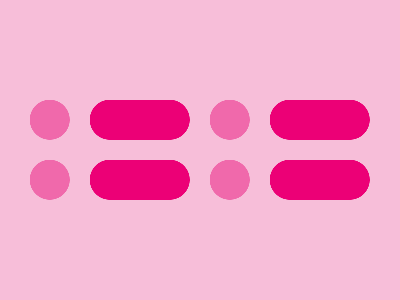

# ✅ CSS Battle Daily Target: 11/07/2025

  
[Play Challenge](https://cssbattle.dev/play/gBbQiWv1sfQdxJhkFrFY)  
[Watch Solution Video](https://youtube.com/shorts/8c9N2RD_K-4)

---

## 🔢 Stats

**Match**: ✅ 100%  
**Score**: 🟢 647.3 (Characters: 224)

---

## ✅ Code

```html
<p><a>
<style>
*{
  background:#F7BED9
}
  p,a{
    position:fixed;
    background:#F069AB;
    padding:20;
    border-radius:30px;
    margin:92 22;
    color:F069AB;
    box-shadow:190q 0,0 60px,190q 60px
  }
  a{
    background:#EC0076;
    padding:20+50;
    color:EC0076;
    margin:-20 40
  }
</style>
```

---

## ✅ Code Explanation

This target features a **2×2 grid of rounded pink pills**, with an additional **larger pink rectangle** overlapping the bottom right, all set against a **soft pink background**.

---

### 🎨 Background

The canvas background is set to a **light pink** color (`#F7BED9`) using the universal selector, giving the entire design a soft and playful tone.

---

### 🟣 Top Pills (2x2 Grid)

The `<p>` element is styled as a **small rounded pill** using:

* A **pink background** (`#F069AB`)
* `padding: 20` for pill sizing
* `border-radius: 30px` for full rounding
* A `margin` that places it neatly on the top-left

To replicate the grid, multiple `box-shadow` entries are used:

* One shadow places the second pill to the right
* Another places one pill below the first
* A final shadow places the fourth pill at the bottom right

This results in a **2x2 formation** of evenly spaced pills.

---

### 🟣 Overlapping Larger Rectangle

The `<a>` element forms a **larger rectangle** that overlaps the bottom-right pill. It uses:

* A **darker pink shade** (`#EC0076`) for contrast
* Increased padding (`20+50`) to stretch vertically
* Negative top margin to lift it into place
* Same border-radius to maintain the pill-like feel

This creates a sense of depth and highlights the active or emphasized element in the layout.

---

### 🧠 Techniques Used

* **Box-shadow cloning** to duplicate pills without extra HTML
* **Precise margin control** for clean alignment and overlap
* **Color layering** for visual hierarchy
* **Minimal HTML** with only two tags achieving all shapes

---

### 🏁 Summary

* **Background**: Soft pink (`#F7BED9`)
* **Main Elements**: Four rounded pills in a 2x2 grid
* **Highlight**: One darker, larger rectangle overlapping the bottom right
* **Effect**: Clean, grid-based design with visual emphasis
* **Approach**: Efficient shadow and margin use
* **Score Achieved**: ✅ 100% match using **224 characters**