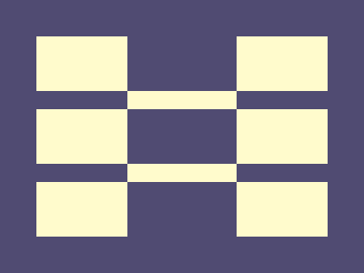

# ✅ CSS Battle Daily Target: 12/07/2025

  
[Play Challenge](https://cssbattle.dev/play/zGV15jqNGthtIZSLT0KV)  
[Watch Solution Video](https://youtube.com/shorts/CJ1wg8zW08w)

---

## 🔢 Stats

**Match**: ✅ 100%  
**Score**: 🟢 657.23 (Characters: 204)

---

## ✅ Code

```html
<p><a>
<style>
*{
  background:#504B72;
  position:fixed
}
  p,a{
    background:#FFFBCC;
    padding:30+50;
    margin:32;
    color:FFFBCC;
    box-shadow:233q 0,0 85q,233q 85q,0 169q,233q 169q
  }
  a{
    padding:10+60;
    margin:30 50;
    box-shadow:0 85q
  }
</style>
```

---

## ✅ Code Explanation

This challenge features a **grid of six pale yellow vertical pills** on a **purple background**, aligned in **three rows and two columns**. One shape appears repeated across rows and columns, forming a clean, tile-like pattern.

---

### 🎨 Background

The canvas is filled with a **deep purple** (`#504B72`) using the universal selector. This sets a contrasting base for the pale yellow pills.

---

### 🟨 Vertical Pills (Grid Layout)

Both the `<p>` and `<a>` elements use the same pill shape — a vertical rectangle with rounded ends:

* They use `background: #FFFBCC` for a soft pale yellow tone.
* Padding values like `30+50` and `10+60` give them a **tall, narrow shape**, and the lack of a specific `border-radius` still gives them a rounded pill appearance due to the padding ratio.
* `position: fixed` allows free placement across the canvas.

The **box-shadow** on each element is the core of the layout:

* `<p>` produces five clones: two to the right and three below the main shape, creating a **3×2 grid**.
* `<a>` reinforces the layout with an additional clone for better alignment, using vertical box-shadows.

Together, these six pills are arranged evenly in two columns and three rows.

---

### 🧠 Techniques Used

* **Box-shadow cloning** replicates the base pill shape across the grid without extra HTML elements.
* **Precise padding and margins** control the shape and layout.
* **Multiple elements** are used efficiently to manage offsets and grid spacing with fewer characters.
* **Fixed positioning** allows complete control over layout and spacing.

---

### 🏁 Summary

* **Background**: Deep purple (`#504B72`)
* **Shapes**: Six tall pale yellow vertical pills arranged in 3 rows and 2 columns
* **Effect**: Neat, symmetric grid of vertical bars
* **Approach**: Minimal elements with strategic use of box-shadow for duplication
* **Score Achieved**: ✅ 100% match using **204 characters**