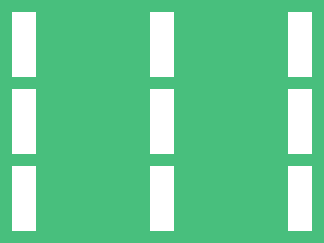

# ✅ CSS Battle Daily Target: 13/07/2025

  
[Play Challenge](https://cssbattle.dev/play/4K1nE3mlF0aqtgqqb2cE)  
[Watch Solution Video](https://youtube.com/shorts/KHDRm4PIt-U)

---

## 🔢 Stats

**Match**: ✅ 100%  
**Score**: 🟢 695.76 (Characters: 150)

---

## ✅ Code

```html
<p><a><b>
<style>
*{
  background:#48BF7D
}
  p,a,b{
    position:fixed;
    background:#FFF;
    padding:40+15;
    margin:7;
    color:FFF;
    box-shadow:0 101q,0 201q
  }
  a,b{
    margin:-40 155
  }
</style>
```

---

## ✅ Code Explanation

This target shows **two vertical columns** of **three white pills each**, placed symmetrically on a **green background**. The layout is minimal, elegant, and perfectly aligned using box-shadow and repeated styling.

---

### 🎨 Background

The canvas is filled with a **vibrant green** (`#48BF7D`) using the universal selector, setting a bright and fresh base tone for the layout.

---

### ⚪ Vertical White Pills

Three HTML elements (`<p>`, `<a>`, and `<b>`) are used, all styled identically to represent pill shapes:

* Each element is given a **white background**.
* Padding values like `40+15` make them appear as **tall vertical pills**.
* `color` is matched to the background (`#FFF`) to avoid any text display.
* `box-shadow` duplicates the original pill vertically, creating two additional pills below each one (spaced at `101q` and `201q` units).

This means **each element generates three vertical pills** — one from the element itself and two from the shadow.

To create the **two-column layout**, two of the three elements (`<a>` and `<b>`) are shifted to the right using a horizontal margin (`margin: -40 155`), forming the **right-side column**, while the first element (`<p>`) stays left.

The result is **two vertical columns of pills**, each with three stacked pills, neatly aligned and perfectly symmetric.

---

### 🧠 Techniques Used

* **Box-shadow duplication** to efficiently clone pill shapes with minimal HTML.
* **Multiple elements reused with identical styles**, but different horizontal positioning, to split the grid into two columns.
* **Fixed positioning and fine-tuned margin** ensure visual balance and pixel-perfect alignment.
* **No need for explicit border-radius** because the pill shape is formed naturally through the padding ratio.

---

### 🏁 Summary

* **Background**: Bright green (`#48BF7D`)
* **Shapes**: Two vertical columns of three white pill-shaped blocks
* **Effect**: Symmetric and clean, resembling UI pills or buttons
* **Approach**: Minimal HTML (just three tags) and smart use of shadows and margins
* **Score Achieved**: ✅ 100% match using **150 characters**