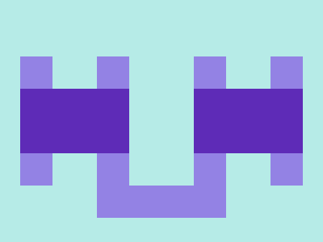

# ✅ CSS Battle Daily Target: 19/07/2025

  
[Play Challenge](https://cssbattle.dev/play/jMQhLYgZgAqjEBG95Ea0)  
[Watch Solution Video](https://youtube.com/shorts/P6yxAVWMeps)

---

## 🔢 Stats

**Match**: ✅ 100%  
**Score**: 🟢 643.41 (Characters: 233)

---

## ✅ Code

```html
<p><a><b><c><d>
<style>
*{
  background:#B6EBE7;
  position:fixed
}
  p,b,d{
    background:#9382E4;
    padding:80+20;
    margin:62 17;
    box-shadow:95px 0#9382E4
  }
  a,c{
    background:#5E2BB7;
    padding:40+67.5;
    margin:-40-20
  }
  b{
    margin:-80 147
  }
  d{
    rotate:90deg;
    margin:20-127
  }
</style>
```

---

## ✅ Code Explanation

This CSS Battle challenge recreates a **twin purple pill-shaped bar layout** on a **light teal background** using clever nesting and box shadows.

---

### 🎨 Background

The canvas is filled with a light cyan shade (`#B6EBE7`) using the universal selector. This ensures all positioned elements are placed over a consistent background.

---

### 🧱 Structure

The solution uses five nested HTML tags: `p`, `a`, `b`, `c`, and `d`. Each tag is styled as a block-level shape, and together they create two identical bars — one horizontal and one vertical.

* The `p`, `b`, and `d` tags form the horizontal purple bar. All are given the same background color (`#9382E4`) and dimensions using padding and margin. The bar’s mirrored appearance is achieved through a `box-shadow` on each.
* The `a` and `c` tags form a similar structure but use a different shade of purple (`#5E2BB7`) and are rotated using `margin` and positioning tricks to overlap with the first set and build the cross.
* The `b` and `d` tags reposition the bars with adjusted margins to finalize the vertical shape.

---

### 🌀 Layout Tricks

* All elements use `position: fixed` to lock them relative to the viewport, ensuring consistent placement regardless of nesting.
* The illusion of two bars intersecting is created using duplicate shapes with different stacking and positions.
* Padding and margin values use simple arithmetic like `80+20` or `-40-20`, which is valid in CSS and helps save character count while keeping dimensions precise.
* `rotate: 90deg` on the last element (`d`) flips one bar to a vertical orientation, completing the cross pattern.

---

### 🧠 Optimization Highlights

* Using minimal tags and styling each with overlapping and reusable rules keeps the character count low.
* Box-shadow is used to clone each bar without extra HTML elements, which is essential for matching and score.
* Repetition and mirroring avoid unnecessary complexity while achieving the desired visual effect.