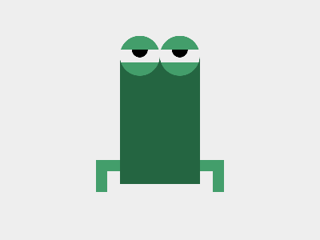

# ✅ CSS Battle Daily Target: 22/07/2025

  
[Play Challenge](https://cssbattle.dev/play/Fd3vvZivSEbFOZFxa2bk)  
[Watch Solution Video](https://youtube.com/shorts/2wrcdZecN6E)

---

## 🔢 Stats

**Match**: ✅ 100%  
**Score**: 🟢 597.49 (Characters: 355)

---

## ✅ Code

```html
<p><a><b>
<style>
*{
  background:#EEE;
  +*{
    background:#246541;
    margin:70 150
  }
}
  p,a,b{
    position:fixed;
    padding:13+8;
    margin:144 100;
  }
  p{
    box-shadow:7q -7q 0 8q#439E6B;
    -webkit-box-reflect:left 106q
  }
  a{
    padding:25;
    margin:-182-58;
    border-radius:50%;
    background:linear-gradient(#439E6B 35%,#EEE 0 67%,#439E6B 0)
  }
  b{
    padding:5+9;
    background:#000;
    border-radius:0 0 22q 22q;
    margin:-8
  }
</style>
```

---

## ✅ Code Explanation

This clever 3-element solution recreates the **CSS Battle “Watch”** design using `<p>`, `<a>`, and `<b>` tags styled and layered precisely with `position: fixed`, gradients, box shadows, and reflection.

---

### 🎯 Overall Layout

* The base `*` selector applies a light background: `#EEE`.
* The `+*` sibling selector targets the second element and applies a **green circular background** (`#246541`) with margins to push it into the desired spot.

---

### 🧱 Element Breakdown

#### 1. `<p>` – Creates the **green bands**

* Styled with `box-shadow` to draw the top left band (`7q -7q`) and the bottom right one using `-webkit-box-reflect`.
* This makes two **green stripes** extending diagonally outward like watch straps.
* Positioned using `fixed` and `margin` for precise placement.

#### 2. `<a>` – Main **watch face**

* Circular (`border-radius: 50%`) with a `linear-gradient` background:

  * Green top and bottom arcs (`#439E6B`)
  * Middle white section (`#EEE`)
* Creates the illusion of a **watch with a banded bezel**.
* Padding controls the diameter, and negative margins bring it into position.

#### 3. `<b>` – **Center dial**

* Small black rectangle with rounded bottom edges, like a **watch knob** or inner marker.
* Added with `padding` and small `margin`, layered on top of `<a>`.

---

### 🧠 Smart Tricks Used

* **Box reflection** to avoid repeating HTML for both straps.
* **Gradient stops** to build precise striping on the watch face.
* **Shorthand padding math** like `13+8` (CSS Battle accepts expressions).
* **No IDs, classes, or extra tags** – efficient tag reuse keeps the character count low.