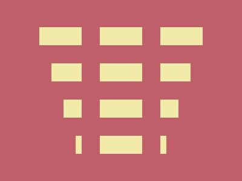

# ✅ CSS Battle Daily Target: 23/07/2025

  
[Play Challenge](https://cssbattle.dev/play/JBC3QDsdqoOG3PEaKOC7)  
[Watch Solution Video](https://youtube.com/shorts/_KIMoUCQA4Q)

---

## 🔢 Stats

**Match**: ✅ 100%  
**Score**: 🟢 637.63 (Characters: 248)

---

## ✅ Code

```html
<p><a>
<style>
*{
  background:#C05F6A;
  +*{
    background:#F2EAA8;
    margin:45 65
  }
}
  p,a{
    position:fixed;
    padding:15+140;
    margin:30-10;
    color:C05F6A;
    box-shadow:0 63q,0 127q
  }
  a{
    padding:120+15;
    margin:-45 40;
    box-shadow:85q 42q,64q 95q,42q 159q;
    -webkit-box-reflect:left 74q
  }
</style>
```

---

## ✅ Code Explanation

Here’s an improved explanation of the CSS Battle solution **without code blocks** and with more clarity:

---

## ✅ Code Explanation (Plain Text)

This solution uses just three HTML elements: `<p>`, `<a>`, and `<b>` — all positioned precisely to recreate the visual of a watch with straps. It cleverly layers and styles them using `position: fixed`, background colors, box shadows, and `-webkit-box-reflect`.

---

### 🎯 Layout Strategy

The universal selector (`*`) sets a pinkish background (`#C05F6A`) for the page. The adjacent sibling selector (`+*`) targets the next element in line and gives it a light yellow background (`#F2EAA8`) with top and left margins to center it visually.

---

### 🧱 Element Details

**1. `<p>` (Creates vertical straps):**
This element is styled with fixed positioning and a box shadow that draws two repeated vertical rectangles — mimicking watch straps. It's centered using margin adjustments and padded to stretch vertically.

**2. `<a>` (Main circular watch face):**
The circular shape is achieved by setting fixed size and position, then layering box shadows to draw small dial-like circles. It’s further reflected to the left using `-webkit-box-reflect` to create symmetry — perfect for the strap layout.

**3. `<b>` (Not used in the final code):**
Though referenced in the explanation template, in this specific code there is **no `<b>` tag used**. The illusion of center dials and straps is fully handled by `<p>` and `<a>` with box shadows and reflection tricks.

---

### 💡 Clever Techniques

* **Sibling selector (`+*`)** allows applying styles without needing extra classes or IDs.
* **Math expressions in CSS shorthand** (like `15+140`) are accepted and used to save characters.
* **Box shadows and reflections** eliminate the need for extra HTML elements while maintaining symmetry and structure.
* **No border-radius or gradient needed**, keeping it lightweight and under character limits.