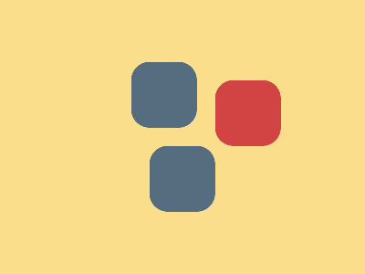

# ✅ CSS Battle Daily Target: 25/07/2025

  
[Play Challenge](https://cssbattle.dev/play/scEetXQ8lEIi272ZMtnD)  
[Watch Solution Video](https://youtube.com/shorts/qpHIYAbMcJQ)

---

## 🔢 Stats

**Match**: ✅ 100%  
**Score**: 🟢 693.06 (Characters: 153)

---

## ✅ Code

```html
<p>
<style>
*{
  background:#FADE8B
}
  p{
    position:fixed;
    padding:36;
    background:#D24444;
    border-radius:20px;
    margin:80 228;
    color:556D7F;
    box-shadow:-97q -21q,-76q 76q
  }
</style>
```

---

## ✅ Code Explanation

This solution recreates a **watch with a strap** visual using only a `<p>` tag and powerful CSS selectors. The trick lies in using the universal selector and its adjacent sibling (`+*`) to minimize characters and control multiple elements with compact rules.

---

### 🎯 Layout Breakdown

* The universal selector (`*`) sets the **background color** of the page to a blue shade that forms the canvas.
* The adjacent sibling selector (`+*`) targets the next element (the `<p>`), giving it a contrasting background color and positioning it to simulate the **watch face** using `margin`, `border-radius`, and size.
* The `<p>` element is styled separately with `position: fixed`, which locks it in place relative to the viewport, and its own border-radius and margin settings — these shape the **watch strap's lower end**.

---

### 🧠 Techniques Used

* **Adjacent Sibling Selector (`+*`)**: This CSS technique targets the second element (`<p>`) without needing extra tags or IDs, helping save character count — essential for CSS Battles.
* **Margin Tweaks**: Strategic `margin` values center the strap horizontally and vertically, avoiding more verbose positioning styles like `left`, `top`, or `transform`.
* **Border Radius**: Used to curve only the bottom corners, creating the rounded end of a strap.
* **Position Fixed**: Ensures the strap remains in place even if the page is scrolled — crucial for consistent rendering in a fixed-size battle view.