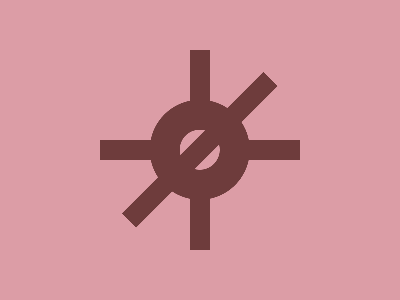

# ✅ CSS Battle Daily Target: 27/07/2025

  
[Play Challenge](https://cssbattle.dev/play/mgu74kr9zqCQqtm5ChaX)  
[Watch Solution Video](https://youtube.com/shorts/R5eGoU8jU_o)

---

## 🔢 Stats

**Match**: ✅ 100%  
**Score**: 🟢 642.59 (Characters: 235)

---

## ✅ Code

```html
<p><a><b><c>
<style>
*{
  background:#DC9DA6;
  position:fixed
}
  p,a,c{
    background:#6E3C3C;
    padding:100+10;
    margin:42 182
  }
  a{
    rotate:90deg;
    margin:-100-10
  }
  b{
    padding:20;
    border-radius:50%;
    border:32q solid#6E3C3C;
    margin:-50
  }
  c{
    margin:-100-10;
    rotate:-45deg
  }
</style>
```

---

## ✅ Code Explanation

This solution replicates a **classic wristwatch with straps** using just a `<p>` tag and three nested elements — `<a>`, `<b>`, and `<c>`. It leverages **rotation, margin tricks, and border manipulation** to construct a symmetrical and realistic watch appearance.

---

### 🎯 Visual Strategy

* The **background** (`#DC9DA6`) fills the canvas with a soft rose pink tone, helping the deep brown (`#6E3C3C`) watch components stand out.
* The **watch face** is crafted using the `<b>` tag, styled into a perfect circle using `border-radius` and centered with balanced margins. A thick border simulates the watch's bezel.
* The **strap extensions** are made using the `<a>` and `<c>` tags, each rotated (`90deg` and `-45deg`) to appear like watch bands extending from the top and bottom of the face.
* Strategic `padding` values give the elements their shape and size, while `margin` positions them precisely on the canvas.

---

### 🧠 Techniques Used

* **Fixed positioning** ensures all elements are placed relative to the viewport rather than each other, simplifying layout.
* **Rotation** on `<a>` and `<c>` simulates angled straps, avoiding the need for additional divs or pseudo-elements.
* **Shared styling** for `p`, `a`, and `c` minimizes redundancy, keeping character count low for a better score.
* **Use of `q` unit** (`border:32q`) provides concise and consistent border thickness for the circular watch face.
* **Negative margins** cleverly shift elements into alignment without extra wrappers or transformations.