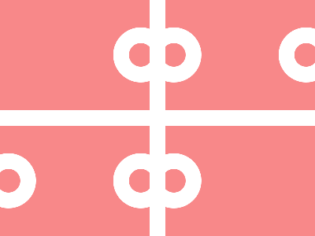

# ✅ CSS Battle Daily Target: 07/08/2025

  
[Play Challenge](https://cssbattle.dev/play/0VNq91mJTcvFqX8rrcAj)  
[Watch Solution Video](https://youtube.com/shorts/VRBYF7fmRwo)

---

## 🔢 Stats

**Match**: ✅ 100%  
**Score**: 🟢 625.22 (Characters: 290)

---

## ✅ Code

```html
<p><a><b>
<style>
*{
  background:#F88889;
  +*{
    background:#FFF;
    margin:140 0;
    *{
      position:fixed
    }
  }
}
  p,a{
    
    border-radius:50%;
    padding:15;
    color:F88889;
    box-shadow:44q 0,0 0 0 21q#FFF,44q 0 0 21q#FFF,222q 0,222q 0 0 21q#FFF;
    margin:-85 164;
  }
  a{
    scale:-1;
    margin:145 27
  }
  b{
    padding:200+10;
    background:#FFF;
    margin:-70 11
  }
</style>
```

---
