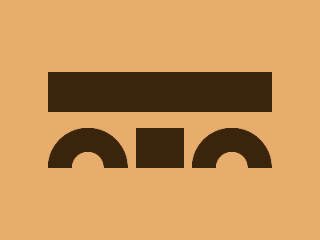

# ✅ CSS Battle Daily Target: 18/08/2025

  
[Play Challenge](https://cssbattle.dev/play/Bk5hytqhhsXsuac7U51B)  
[Watch Solution Video](https://youtube.com/shorts/y2bkKnoH3NE)

---

## 🔢 Stats

**Match**: ✅ 100%  
**Score**: 🟢 613.57 (Characters: 218)

---

## ✅ Code

```html
<p><a><b></b><c></c><d>
<p><a><b><c>
<style>
*{
  background:#E8AD6D;
  position:fixed;
  color:3B240C
}
  p,a,b{
    border:32q solid
  }
  p{
    margin:152 162
  }
  a,b{
    padding:20;
    border-radius:50%;
    margin:-30 40
  }
  b{
    margin:-50-230
  }
  c{
    margin:0-50;
    padding:25+140;
    box-shadow:0-127q
  }
</style>
```

---
