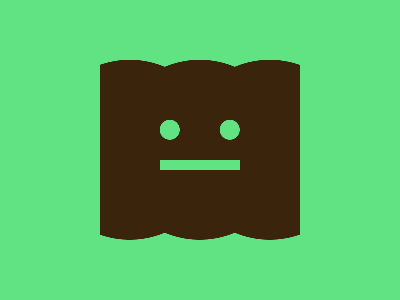

# ✅ CSS Battle Daily Target: 24/08/2025

  
[Play Challenge](https://cssbattle.dev/play/b150AE1x633kzUxkl6cC)  
[Watch Solution Video](https://youtube.com/shorts/TNf2Di7XBXk)

---

## 🔢 Stats

**Match**: ✅ 100%  
**Score**: 🟢 627.21 (Characters: 282)

---

## ✅ Code

```html
<p><a>
<style>
*{
  background:#62E383;
  +*{
    background:#3B240C;
    margin:60 110;
    border-radius:50%;
    color:3B240C;
    box-shadow:73q 0,-73q 0;
    *{
      position:fixed;
      color:#62E383
    }
  }
}
  p{
    padding:10;
    border-radius:50%;
    margin:60 50;
    box-shadow:63q 0
  }
  a{
    padding:5+40;
    margin:30-10;
    box-shadow:250q 0 0 1in,-250q 0 0 1in
  }
</style>

```

---
