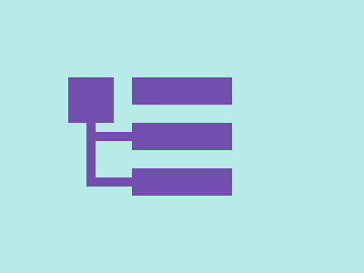

# ✅ CSS Battle Daily Target: 28/08/2025

  
[Play Challenge](https://cssbattle.dev/play/5OEh8pFFdkiA3RJvztNc)  
[Watch Solution Video](https://youtube.com/shorts/HJ_3glkkwZk)

---

## 🔢 Stats

**Match**: ✅ 100%  
**Score**: 🟢 645.53 (Characters: 228)

---

## ✅ Code

```html
<p><a>
<style>
*{
  background:#B6EBE7
}
  p,a{
    position:fixed;
    padding:20;
    margin:137 87;
    color:724FAF;
    box-shadow:-26q -37q 0-26q,-26q -65px 0-5px
  }
  p{
    border:11q solid
  }
  a{
    padding:15+55;
    margin:-120 20;
    box-shadow:0 32q,0 85q,0 106q#B6EBE7,0 138q
  }
</style>

```

---