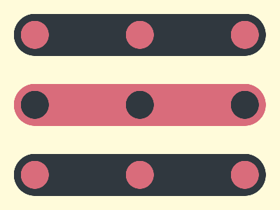

# ✅ CSS Battle Daily Target: 14/09/2025

  
[Play Challenge](https://cssbattle.dev/play/8Y18ZBfe1ZMUo5dnVEsR)  
[Watch Solution Video](https://youtube.com/shorts/oRLAmzrHPZ8)

---

## 🔢 Stats

**Match**: ✅ 100%  
**Score**: 🟢 651.05 (Characters: 216)

---

## ✅ Code

```html
<p><a><b>
<style>
*{
  background:#FFFBDA;
  *{
    background:#D96C7B;
    margin:120 20;
    border-radius:50q;
    color:30383F;
    box-shadow:0 106q,0-106q;
    *{
      position:fixed;
      padding:20;
      background:#30383F;
      margin:10;
      color:D96C7B
    }
  }
}
  a,b{
    margin:-20 130
  }
</style>

```

---