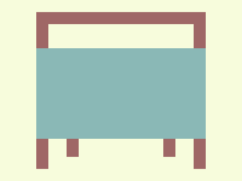

# ✅ CSS Battle Daily Target: 23/09/2025

  
[Play Challenge](https://cssbattle.dev/play/xmaTBk6K7VFRqdAH2lgu)  
[Watch Solution Video](https://youtube.com/shorts/FbWtClFsDjE)

---

## 🔢 Stats

**Match**: ✅ 100%  
**Score**: 🟢 634.87 (Characters: 256)

---

## ✅ Code

```html
<p><a>
<style>
*{
  background:#F7FCDC;
  *{
    background:#8AB8B6;
    margin:80 60 70
  }
}
  p,a{
    position:fixed;
    background:#9F6766;
    padding:10+70;
    margin:-60 0
  }
  p{
    -webkit-box-reflect:right
  }
  a{
    padding:15+10;
    margin:200-20;
    color:#9F6766;
    box-shadow:-53q 0,-53q 21q,-53q -190q,-53q -205q
  }
</style>
```

---