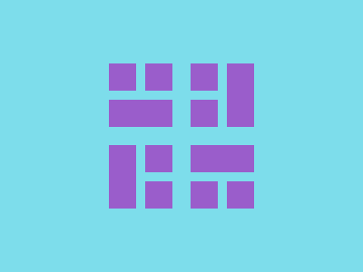

# ✅ CSS Battle Daily Target: 24/09/2025

  
[Play Challenge](https://cssbattle.dev/play/WiYLuR5Ml0BikzqL5B5S)  
[Watch Solution Video](https://youtube.com/shorts/lGRyGKLs4gA)

---

## 🔢 Stats

**Match**: ✅ 100%  
**Score**: 🟢 637.63 (Characters: 248)

---

## ✅ Code

```html
<p><a><b><c>
<style>
*{
  background:#7DDDEB;
  +*{
    background:#9A5DCB;
    margin:70 120;
    *{
      position:fixed;
      padding:35+5;
      margin:90 30;
      color:#7DDDEB;
      box-shadow:48q 0 0 5px,95q 42q
    }
  }
}
a,c{
  padding:5+40;
  margin:-5;
  box-shadow:62q 0,48q -48q 0 5px
}
  b{
    scale:-1;
    margin:-125 50
  }
</style>
```

---