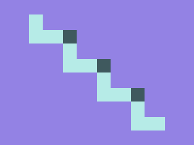

# ✅ CSS Battle Daily Target: 30/09/2025

  
[Play Challenge](https://cssbattle.dev/play/Kyu8JDW0V39c8sZOlo63)  
[Watch Solution Video](https://youtube.com/shorts/zCn3FmlLCIA)

---

## 🔢 Stats

**Match**: ✅ 100%  
**Score**: 🟢 640.61 (Characters: 240)

---

## ✅ Code

```html
<p><a><b>
<style>
*{
  background:#9382E4;
  position:fixed;
  color:B6EBE7;
  box-shadow:70px 60px,140px 120px,210px 180px
}
  p{
    background:#B6EBE7;
    padding:30+35;
    margin:22 52
  }
  a{
    padding:16+21;
    margin:-30-7;
    color:#9382E4
  }
  b{
    padding:14;
    margin:-44-49;
    color:3F595E
  }
</style>
```

---