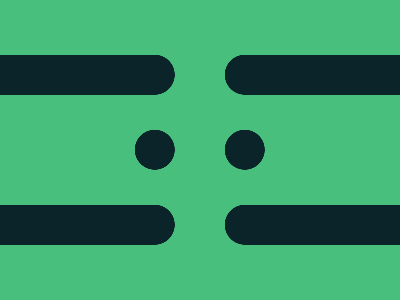

# ✅ CSS Battle Daily Target: 08/10/2025

  
[Play Challenge](https://cssbattle.dev/play/7vDkVGXDYLSjAqjAE5uN)  
[Watch Solution Video](https://youtube.com/shorts/yVR_dqq9NKA)

---

## 🔢 Stats

**Match**: ✅ 100%  
**Score**: 🟢 653.03 (Characters: 212)

---

## ✅ Code

```html
<p><a>
<style>
*{
  background:#48BF7D
}
  p,a{
    position:fixed;
    padding:20+80;
    margin:122 235;
    color:0B2429;
    box-shadow:0-79q,0 79q
  }
  p{
    -webkit-box-reflect:left 91q
  }
  a{
    background:#0B2429;
    padding:20;
    border-radius:50%;
    margin:-20-98
  }
</style>

```

---