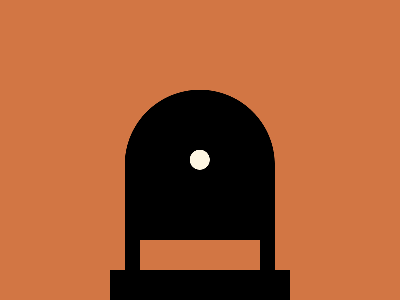

# ✅ CSS Battle Daily Target: 10/10/2025

  
[Play Challenge](https://cssbattle.dev/play/PzmEXsY1eugUMixsItto)  
[Watch Solution Video](https://youtube.com/shorts/4rXwV0RHtvc)

---

## 🔢 Stats

**Match**: ✅ 100%  
**Score**: 🟢 656.15 (Characters: 206)

---

## ✅ Code

```html
<p>
<style>
*{
  background:#D27644;
  +*{
    background:#FEF6E2;
    border-radius:50%;
    margin:90 125 60;
    box-shadow:0-6q 0 65px inset
  }
}
  p{
    position:fixed;
    padding:15+60;
    margin:135 0;
    border:16q solid;
    box-shadow:0 64q 0 16q,0-58q
  }
</style>
```

---