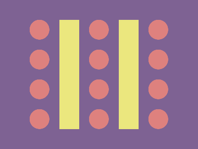

# ✅ CSS Battle Daily Target: 11/10/2025

  
[Play Challenge](https://cssbattle.dev/play/8GV4THuZMLIMu3I3dVnZ)  
[Watch Solution Video](https://youtube.com/shorts/p6XvEulqi7o)

---

## 🔢 Stats

**Match**: ✅ 100%  
**Score**: 🟢 628.27 (Characters: 278)

---

## ✅ Code

```html
<p><a><b><d><e>
<style>
*{
  background:#7E6293;
  position:fixed
}
  p,a{
    padding:110+20;
    background:#EBE77E;
    margin:32 232
  }
  a{
    margin:-110-140
  }
  b,d,e{
    padding:20;
    border-radius:50%;
    margin:-110 40;
    background:#DE817E;
    color:DE817E;
    box-shadow:0 60px,00 120px,0 180px
  }
  d{
    margin:-20 100
  }
  e{
    margin:-20-260
  }
</style>
```

---