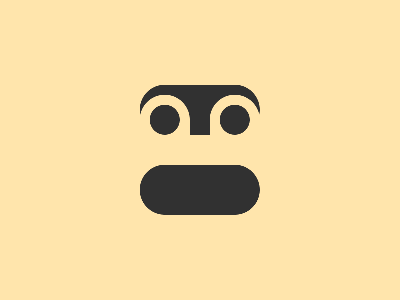

# 🎯 CSS Battle Daily Target: 08/11/2025

  
🎮 [Play Challenge](https://cssbattle.dev/play/2qWE0ANpQnAkjdd2lht5)  
🎥 [Watch Solution Video](https://youtube.com/shorts/t4ShAUmlsfI)

---

## 📈 Battle Stats

| 🧩 Metric      | 🔹 Value  |
| :------------- | :-------- |
| **Match**      | ✅ 100%    |
| **Score**      | 🟢 633.24 |
| **Characters** | ✏️ 261    |

---

## 💻 Code

```html
<p><a><b>
<style>
*{
  background:#FFE5AC;
  position:fixed;
  color:313131
}
  p,b{
    padding:25+60;
    background:#313131;
    border-radius:32q;
    margin:77 132;
    box-shadow:0 85q
  }
  a{
    padding:25;
    margin:-15-60;
    border-radius:32q 32q 0 0;
    color:FFE5AC
  }
  a,b{
    box-shadow:74q 0
  }
  b{
    padding:15;
    margin:-15
  }
</style>
```

---
