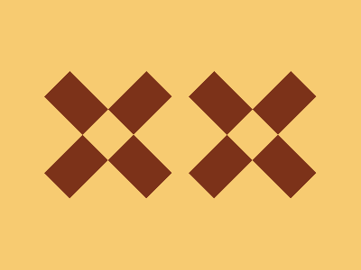

# 🎯 CSS Battle Daily Target: 01/01/2026

  
🎮 [Play Challenge](https://cssbattle.dev/play/2KupYkcntZudnUXHlLq1)  
🎥 [Watch Solution Video](https://youtube.com/shorts/W2KAI916nLo)

---

## 📈 Battle Stats

| 🧩 Metric      | 🔹 Value  |
| :------------- | :-------- |
| **Match**      | ✅ 100%    |
| **Score**      | 🟢 640.23 |
| **Characters** | ✏️ 241    |

---

## 💻 Code

```html
<p><a><b>
<style>
*{
  background:#F7CB71;
  position:fixed
}
  p,a{
    padding:80+20;
    background:#7C3219;
    rotate:45deg;
    margin:62 92;
    color:7C3219;
    box-shadow:119q -119q
  }
  a{
    rotate:-90deg;
    margin:-80-20
  }
  a,b{
    box-shadow:120q 120q
  }
  b{
    padding:20;
    margin:-20;
    color:F7CB71
  }
</style>
```

---
