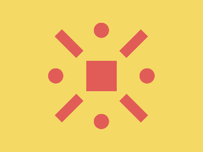

# 🎯 CSS Battle Daily Target: 10/01/2026

  
🎮 [Play Challenge](https://cssbattle.dev/play/m90z6ArWKRiIEzasM2kJ)  
🎥 [Watch Solution Video](https://youtube.com/shorts/2pRXcNdTOGQ)

---

## 📈 Battle Stats

| 🧩 Metric      | 🔹 Value  |
| :------------- | :-------- |
| **Match**      | ✅ 100%    |
| **Score**      | 🟢 645.97 |
| **Characters** | ✏️ 227    |

---

## 💻 Code

```html
<p><a><b><c>
<style>
*{
  background:#F4DA64;
  *{
    background:#E25C57;
    margin:120 170;
    *{
      position:fixed;
      padding:30+10;
      margin:0 20;
      color:E25C57;
      box-shadow:0 95q,0-95q;
      rotate:45deg
    }
  }
}
  a,c{
    padding:15;
    border-radius:50%;
    margin:-15
  }
  b{
    margin:-30-10
  }
</style>
```

---
